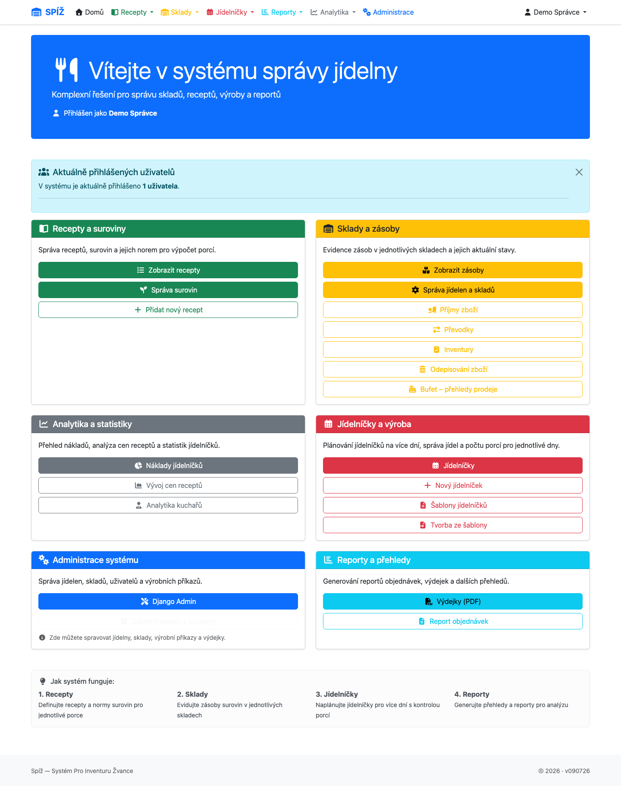

# 1. Úvod a pojmy

## Co je SPÍŽ a co řeší

SPÍŽ (Systém Pro Inventuru Žvance) je webová aplikace pro kompletní správu provozu školní nebo firemní jídelny. Pokrývá celý životní cyklus surovin:

```text
NÁKUP → SKLAD → PLÁNOVÁNÍ → VÝROBA → VÝDEJ → ANALÝZA
(příjemka) (zásoby,    (jídelníček,  (výrobní   (výdejka,   (náklady,
            převodky,   šablony)      příkazy)   odpisy,     ceny,
            inventura)                           bufet)      reporty)
```

Systém odpovídá na tři klíčové otázky provozu:

1. **Kolik čeho máme na skladě a za kolik?** — skladové karty s cenami, inventury, cenová historie.
2. **Kolik surovin potřebujeme vydat do kuchyně?** — receptury s normami na porci, jídelníčky, výdejky.
3. **Kolik nás co stojí?** — kalkulace ceny porce, analytika nákladů, vývoj cen v čase.

Vše je postaveno na jednoduché zásadě: **sklad je vždy pravda**. Každý pohyb surovin (příjem, výdej, převod, odpis, inventurní rozdíl) má svůj doklad a zanechává auditní stopu — kdo, kdy, co a za kolik.

## Slovník pojmů

| Pojem | Význam |
|---|---|
| **Jídelna** | Provozní jednotka (např. „ZŠ Lipová“). Má vlastní sklady, jídelníčky a uživatele. Data jídelen jsou od sebe oddělena. |
| **Sklad** | Fyzické místo uskladnění v rámci jídelny (hlavní sklad, mrazák…). Jídelna může mít skladů více. |
| **Mezisklad** | Zvláštní technický sklad (jeden na jídelnu), přes který prochází zboží při převodu mezi sklady. Uživatel s ním přímo nepracuje. |
| **Surovina** | Položka skladové evidence (mouka, brambory…). Má skladovou jednotku (kg, l, ks) a receptovou jednotku (g, ml, ks) s pevným převodem. |
| **Receptura** | Předpis jídla se surovinami a **normou** — množstvím každé suroviny na 1 porci. |
| **Příjemka** | Doklad o nákupu zboží. Po potvrzení navýší sklad a zapíše ceny. |
| **Převodka** | Doklad o přesunu zboží mezi sklady. Prochází stavy Návrh → V převozu → Dokončeno. |
| **Inventura** | Fyzické přepočítání zásob. Po dobu inventury je sklad zamčený — nelze přijímat ani vydávat. |
| **Výdejka** | Doklad o výdeji surovin do kuchyně na konkrétní vaření. Vzniká z jídelníčku podle normy receptur. |
| **Blokace** | Rezervace množství na skladě pro připravovanou výdejku. Blokované zboží fyzicky na skladě je, ale nelze ho použít jinde. |
| **Odpis** | Výdej mimo recepty — úklid, údržba, prodej v bufetu apod. |
| **Výrobní příkaz** | Jedno jídlo v jídelníčku na konkrétní den (recept + počet porcí ve variantách). |
| **Varianta porce** | Velikostní kategorie porce v rámci jednoho jídla (dospělí ×1,0; děti ×0,75…). |
| **Norma** | Množství suroviny na 1 porci uvedené v receptuře (např. 150 g brambor na porci). |

## Mapa modulů

| Modul (menu) | Co v něm najdete | Kapitola |
|---|---|---|
| **Recepty** | Receptury, suroviny, normy | 3 |
| **Sklady** | Zásoby, příjemky, převodky, inventury, odpisy, bufet | 4, 5, 6, 9 |
| **Jídelníčky** | Plánování, šablony, tvorba ze šablony | 7 |
| **Reporty** | Výdejky (PDF), report objednávek | 8, 10 |
| **Analytika** | Náklady jídelníčků, vývoj cen receptů, analytika kuchařů | 10 |
| **Administrace** | Django admin, správa jídelen a skladů, zálohy | 2, 11 |



## Role a oprávnění

SPÍŽ rozlišuje tři úrovně přístupu:

* **Správce (superuser)** — vidí všechna data všech jídelen, má přístup do Django adminu, spravuje uživatele a zálohy.
* **Běžný uživatel** — má v profilu přiřazenou jednu či více jídelen a vidí **pouze jejich** data: sklady, příjemky, jídelníčky i výdejky. Data cizích jídelen pro něj neexistují.
* **Uživatel pouze pro čtení** (`is_readonly`) — vidí data svých jídelen, ale nemůže nic vytvářet ani měnit. Vhodné pro kontrolní role (ekonomka, ředitel).

💡 **Proč to tak je:** Oddělení dat podle jídelen je vynuceno přímo v aplikaci (každý pohled filtruje podle profilu uživatele), ne jen skrytím odkazů. I kdyby uživatel znal adresu cizího záznamu, systém přístup odmítne.

⚠️ **Pozor:** Uživatel bez vyplněného profilu (bez přiřazených jídelen) neuvidí žádná data a nemůže nahrávat žádné doklady. Pokud si nový kolega stěžuje na „prázdný systém“, zkontrolujte jeho profil — viz kapitola [2. Začínáme](02-zaciname.md) a [11. Správa systému](11-sprava-systemu.md).

Některé operace mají navíc vlastní pravidla bez ohledu na roli:

* Rozběhnutou **inventuru** smí zrušit jen ten, kdo ji zahájil, nebo správce.
* **Zamčený sklad** (probíhající inventura) blokuje příjem, výdej i převody pro všechny.
* Potvrzené doklady (příjemka, dokončená převodka) už nelze editovat — opravy se dělají novým dokladem, aby zůstala auditní stopa.

---

*Technická poznámka pro vývojáře: Role implementuje `UserProfile` (`apps/core/models.py`) s M2M vazbou `canteens` a příznakem `is_readonly`; superuser kontroly obchází. Filtrace dat probíhá ve views přes helper `user_can_access_canteen` (`apps/core/views.py`). Detaily v kapitole [13](13-pro-vyvojare.md).*
