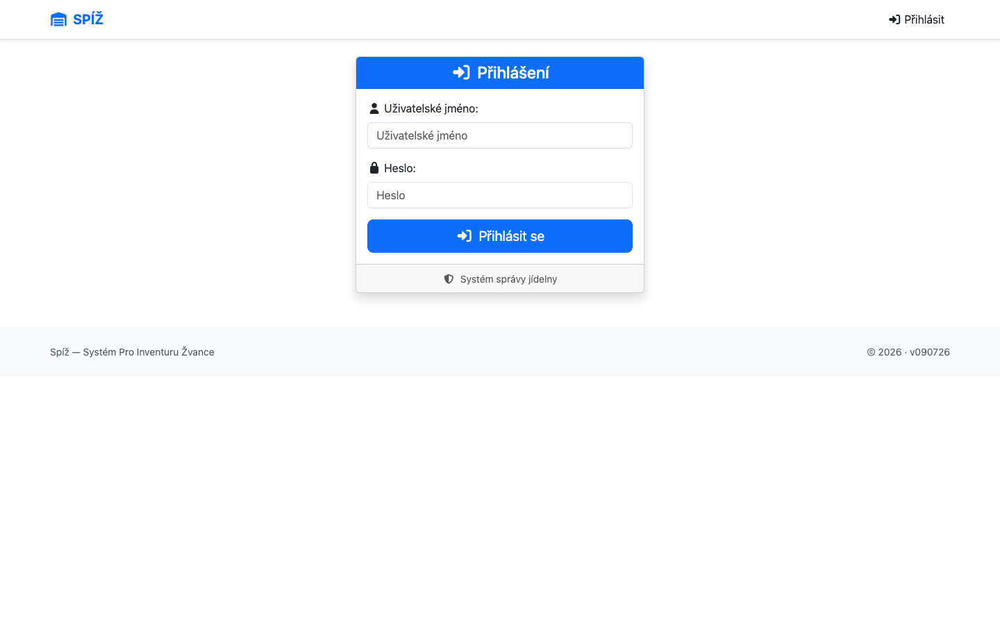
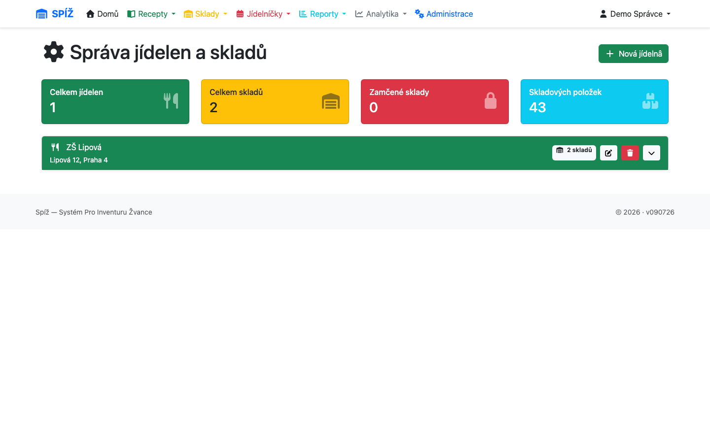

# 2. Začínáme

Tato kapitola provede správce i nového uživatele od prvního přihlášení k plně nastavené jídelně.

## Přihlášení

Aplikace běží ve webovém prohlížeči. Na přihlašovací stránce zadejte uživatelské jméno a heslo, které vám přidělil správce.



Po přihlášení se zobrazí **dashboard** — rozcestník do všech modulů s barevnými kartami (Recepty, Sklady, Jídelníčky, Analytika, Reporty, Administrace). Dashboard také ukazuje počet aktuálně přihlášených uživatelů.

⚠️ **Pozor:** Pokud po přihlášení nevidíte žádné sklady ani jídelníčky, pravděpodobně nemáte v profilu přiřazenou jídelnu. Obraťte se na správce (postup přiřazení je v kapitole [11](11-sprava-systemu.md)).

## První nastavení provozu (správce)

Nastavení nové jídelny probíhá v tomto pořadí — každý krok staví na předchozím:

```text
1. jídelna  →  2. sklady  →  3. uživatelé  →  4. suroviny a receptury  →  5. první příjemka
```

### Krok 1–2: Jídelna a sklady

Otevřete **Sklady → Správa jídelen a skladů** (`/inventory/management/`). Na jedné obrazovce spravujete jídelny i jejich sklady:



1. Tlačítkem **Přidat jídelnu** založte provozní jednotku (název, adresa).
2. U jídelny přidejte sklady — obvykle alespoň **Hlavní sklad**, podle provozu třeba i **Mrazák**, **Suchý sklad** apod.

💡 **Proč to tak je:** Mezisklad (pro převodky) nezakládáte — systém si ho vytvoří sám, jakmile ho poprvé potřebuje, a hlídá, že existuje právě jeden na jídelnu. V seznamech skladů se běžně nezobrazuje.

Sklad má dva provozní příznaky, které uvidíte v seznamech:

* **Zamčeno** — sklad je uzamčen probíhající inventurou; do odemčení nejde přijímat, vydávat ani převádět. Zámek drží inventura, ne správce — odemyká se dokončením nebo zrušením inventury (kapitola [6](06-inventura.md)).
* **Mezisklad** — technický sklad převodek, nepracujte s ním přímo.

### Krok 3: Uživatelé

Uživatele zakládá správce v **Django adminu** (Administrace → Django Admin):

1. **Users → Add user**: jméno a heslo.
2. K uživateli vytvořte **User profile** a v něm zaškrtejte **jídelny**, ke kterým má mít přístup.
3. Volitelně zapněte **pouze pro čtení** (`is_readonly`) — uživatel pak vše vidí, ale nic nemění.

Podrobný postup i se screenshoty je v kapitole [11. Správa systému](11-sprava-systemu.md).

⚠️ **Pozor — nejčastější chyba při zakládání uživatele:** uživatel bez profilu (nebo s profilem bez zaškrtnutých jídelen) se přihlásí, ale systém pro něj bude „prázdný“ a nahrávání dokladů skončí chybou oprávnění. Profil je povinný pro každého běžného uživatele.

### Krok 4: Suroviny a receptury

Suroviny lze zakládat ručně (kapitola [3](03-suroviny-a-receptury.md)), ale při startu se vyplatí **import receptur z XML** — založí receptury včetně surovin najednou (kapitola [3](03-suroviny-a-receptury.md), sekce Import). Suroviny se navíc automaticky dozakládají při importech příjemek.

### Krok 5: První příjemka

Sklad naplníte první příjemkou (kapitola [4](04-prijem-zbozi.md)). Tím se založí skladové karty s množstvím a cenami — a od té chvíle systém umí počítat ceny porcí.

## Princip zamykání skladů

Se zamčeným skladem se potká každý uživatel, proto ho vysvětlujeme hned na začátku:

* Sklad se zamyká **automaticky zahájením inventury** a odemyká jejím dokončením či zrušením.
* Zamčený sklad odmítne: potvrzení příjemky, zahájení i dokončení převodky, výdej výdejkou, odpis i import bufetu. Aplikace vždy vypíše srozumitelnou hlášku typu *„Sklad Hlavní sklad je uzamčen inventurou.“*

💡 **Proč to tak je:** Inventura porovnává fyzický stav se systémovým. Kdyby někdo během počítání přijal nebo vydal zboží, spočtené rozdíly by neodpovídaly ničemu. Zámek je tedy ochrana správnosti inventury, ne šikana — plánujte inventury na dobu mimo příjem a výdej.

⚠️ **Pozor:** Před zahájením inventury dokončete rozpracované doklady na daném skladu. A naopak — když systém hlásí zamčený sklad, nezkoušejte to obejít; podívejte se do **Sklady → Inventury**, kdo inventuru drží (kapitola [12](12-reseni-problemu.md)).

---

*Technická poznámka pro vývojáře: Zámek je pole `Warehouse.is_locked` + `locked_by_inventory` (`apps/canteens/models.py`), nastavované atomicky v `InventoryVerification.start()/complete()/cancel()`. Mezisklad zajišťuje `Canteen.get_or_create_transit_warehouse()` s unique constraintem na `(canteen, is_transit_warehouse=True)`.*
