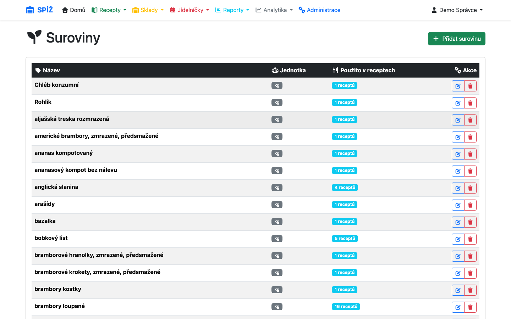
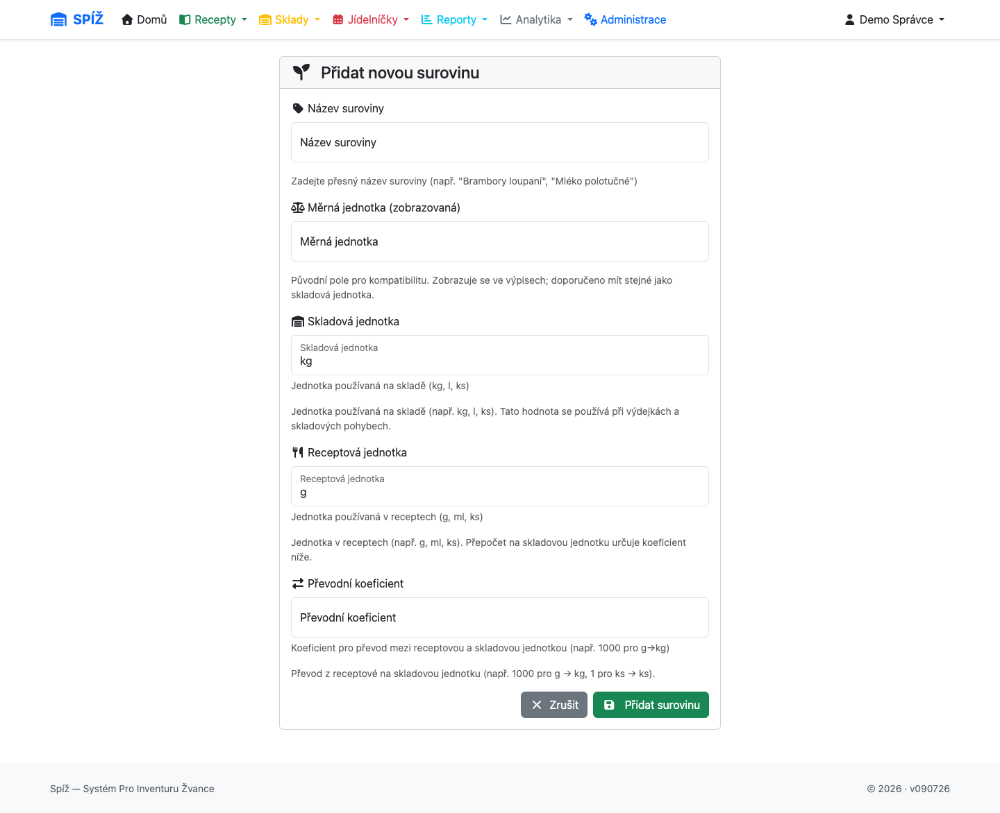
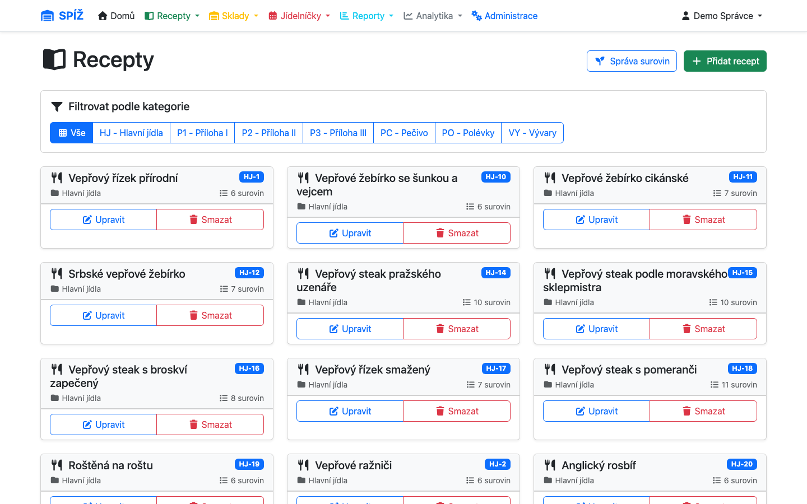

# 3. Suroviny a receptury

Suroviny a receptury jsou základ celého systému: bez surovin není sklad, bez receptur nejde plánovat vaření ani počítat ceny porcí.

## Karta suroviny

Suroviny najdete v **Recepty → Správa surovin** (`/ingredients/`).



Každá surovina má:

* **Název** — jednoznačný v celém systému (nemohou existovat dvě suroviny „mouka hladká").
* **Skladovou jednotku** (`base_unit`) — v čem se surovina eviduje na skladě: kg, l, ks.
* **Receptovou jednotku** (`recipe_unit`) — v čem se píší normy v recepturách: g, ml, ks.
* **Převodní koeficient** (`conversion_factor`) — kolik receptových jednotek tvoří jednu skladovou. Pro g→kg je to 1000, pro ml→l 1000, pro ks→ks 1.



💡 **Proč dvojí jednotky:** Kuchařka v receptu myslí v gramech na porci, skladník ve skladových kilech. Kdyby se převod dělal ručně na každém dokladu, dřív nebo později by někdo vydal 15 kg místo 1,5 kg. Převod je proto uložen **jednou na kartě suroviny** a všechny výpočty (výdejky, kalkulace, reporty) ho používají automaticky. Výdejka tedy vždy ukáže skladové jednotky, receptura receptové — a nikdo nic nepřepočítává.

⚠️ **Pozor:** Převodní koeficient nastavte správně hned při založení. Pozdější změna neovlivní zpětně staré doklady, ale změní výpočet všech budoucích výdejek — při pochybnostech se poraďte se správcem.

### Deaktivace suroviny (místo mazání)

Surovinu, kterou už nepoužíváte, **nemažete, ale deaktivujete** (tlačítko Smazat na kartě suroviny provede právě deaktivaci). Deaktivovaná surovina zmizí ze seznamů a našeptávačů, ale zůstává ve starých recepturách, příjemkách a výdejkách.

💡 **Proč to tak je (soft delete):** Skutečné smazání by roztrhalo historii — loňská výdejka by najednou odkazovala na neexistující surovinu a přestaly by fungovat historické kalkulace. Deaktivace zachová auditní stopu (kdo a kdy deaktivoval) a přitom uklidí pracovní seznamy.

Systém deaktivaci **odmítne**, dokud je surovina „živá". Všech pět podmínek musí být splněno:

1. žádné aktivní (nedokončené) výdejky se surovinou,
2. žádné rozpracované příjemky (stav NÁVRH) se surovinou,
3. žádná probíhající inventura, která surovinu počítá,
4. **nulová zásoba** ve všech skladech,
5. žádné rozpracované převodky se surovinou.

⚠️ **Pozor:** Hláška *„Surovinu nelze deaktivovat"* vždy uvádí konkrétní důvod. Typický postup: doprodat/odepsat zbytek zásoby, dokončit otevřené doklady a deaktivovat znovu. Deaktivovanou surovinu lze kdykoli znovu aktivovat (vidí ji správce v seznamu při zapnutém filtru neaktivních).

## Receptury

Receptury najdete v **Recepty → Zobrazit recepty** (`/recipes/`). Lze je filtrovat podle kategorie a hledat našeptávačem.



Receptura obsahuje:

* **Kód** — automaticky generovaný identifikátor ve formátu `KATEGORIE-ČÍSLO` (např. `PO-012`). 
* **Kategorii** (Polévky, Hlavní jídla, Přílohy…).
* **Základní počet porcí** (`base_portions`, obvykle 10) — na kolik porcí byla norma původně psána; slouží jen jako informace, systém vždy počítá **na 1 porci**.
* **Suroviny s normou** — množství každé suroviny na 1 porci v receptové jednotce (150 g brambor, 0,2 ks vejce…), volitelně s poznámkou („dle potřeby", „na zapražení").
* **Sazbu DPH pro prodej** (`selling_vat_rate`, výchozí 12 %) — používá se při kalkulaci prodejní ceny.

💡 **Proč je kód receptury neměnný:** Kódy se používají v XML šablonách jídelníčků a při importech — jsou to trvalé odkazy. Proto se kód po vytvoření nemění, ani když recepturu přesunete do jiné kategorie; jinak by se šablony, které na ni odkazují, rozbily. Číslování je navíc globální (žádné dva recepty nesdílí kód, ani napříč kategoriemi).

### Norma na 1 porci

Vše v systému je **kalkulováno na 1 porci**. Při plánování jen zadáte počet porcí (a případně koeficient varianty) a systém normu vynásobí:

```
potřeba = norma na porci × počet porcí × koeficient varianty
150 g   ×  120 porcí  ×  1,0   = 18 000 g = 18 kg   (dospělí)
150 g   ×   80 porcí  ×  0,75  =  9 000 g =  9 kg   (děti)
                                           ---------
                                    výdejka: 27 kg brambor
```

Převod g→kg zajistí koeficient suroviny — na výdejce už je rovnou 27 kg.

## Kalkulace ceny porce

U receptury (a v analytice) systém počítá cenu porce takto:

1. Pro každou surovinu vezme **průměrnou skladovou cenu** ve skladech dané jídelny (cena s DPH z příjemek).
2. Vynásobí normou na porci (po převodu jednotek).
3. Sečte za všechny suroviny → **náklad na porci**; k tomu spočte variantu s prodejním DPH.

💡 **Proč průměrná cena jídelny, a ne cena konkrétního skladu:** Kuchyně bere zboží z více skladů (mrazák, hlavní sklad) a ceny se liší podle závozu. Průměr přes sklady jídelny dává stabilní, reprezentativní náklad — kalkulace neskáče podle toho, ze kterého regálu se zrovna vydávalo.

💡 **Proč funguje i zpětně:** Každá změna ceny na skladě se ukládá do **cenové historie**. Kalkulaci lze proto spočítat k libovolnému datu v minulosti („kolik stál guláš v lednu?") — používá to analytika vývoje cen (kapitola [10](10-analytika-a-reporty.md)). Pokud pro datum neexistuje historický záznam, použije se aktuální cena.

⚠️ **Pozor:** Dokud surovina nemá skladovou kartu s cenou (tj. neprošla příjemkou), počítá se s cenou 0 — kalkulace pak vychází nerealisticky nízko. Kalkulacím věřte až po prvním naskladnění všech surovin receptury.

## Import receptur z XML

Při zavádění systému lze receptury hromadně importovat z XML souboru (formát `RecipeBook` s kategoriemi, recepty a surovinami). Import:

* založí chybějící **kategorie** i **suroviny** (s výchozím převodem g→kg),
* vytvoří receptury s normami přepočtenými na 1 porci z `basePortions`,
* existující receptury přeskočí (nebo aktualizuje, spustí-li správce import s volbou aktualizace).

Import spouští správce z příkazové řádky (`manage.py import_recipes_xml soubor.xml`); tentýž formát používají i zálohy (kapitola [11](11-sprava-systemu.md)).

⚠️ **Pozor:** Kód receptu v XML musí být unikátní v celém souboru — kolize kódů import zastaví. U surovin založených importem zkontrolujte jednotky a převodní koeficienty; import volí rozumné výchozí hodnoty, ale mrazené polotovary či kusové zboží mohou vyžadovat ruční úpravu.

---

*Technická poznámka pro vývojáře: Modely `Ingredient`, `Category`, `Recipe`, `RecipeIngredient` v `apps/core/models.py`. Konverze jednotek: `Ingredient.convert_to_base_unit()/convert_to_recipe_unit()`; kalkulace `Recipe.calculate_portion_price(canteen, …, price_date, return_breakdown)` s historií přes `IngredientPriceHistory.get_prices_bulk()`. Podmínky deaktivace: `Ingredient.can_be_deactivated()`. Import: `apps/core/management/commands/import_recipes_xml.py`.*
