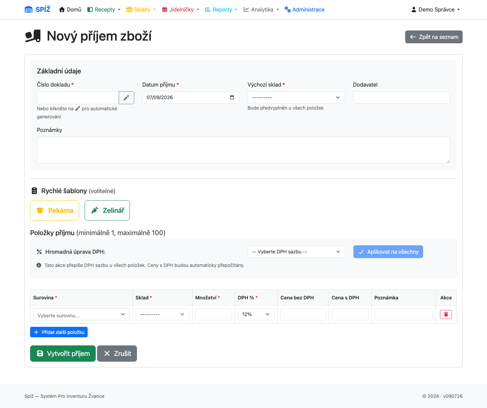
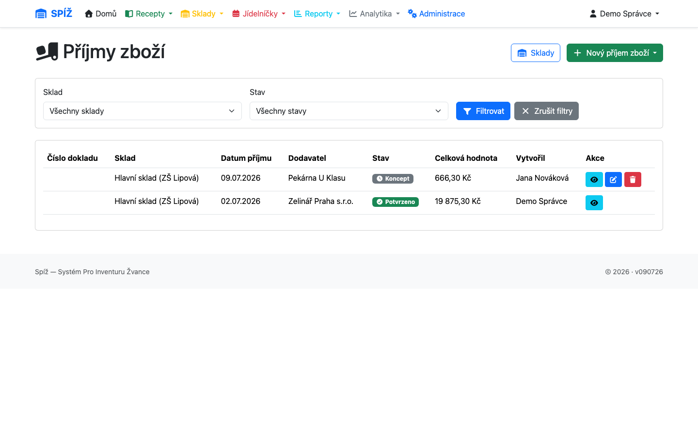
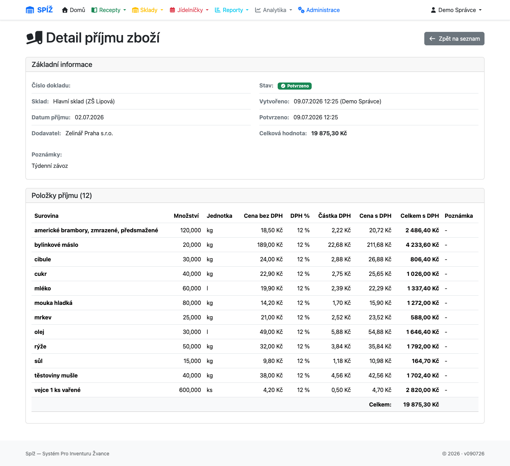

# 4. Příjem zboží

Příjemka je jediná cesta, jak do systému dostat zboží **s cenou**. Vše ostatní (výdejky, odpisy, kalkulace) z cen zavedených příjemkami vychází — proto se vyplatí příjemky dělat pečlivě.

## Jak příjemka funguje

Příjemka prochází dvěma stavy:

```text
KONCEPT (DRAFT) ──[Potvrdit]──► POTVRZENO (CONFIRMED)
   volně editovatelná             už nelze měnit
   sklad nezměněn                 sklad navýšen, ceny zapsány
```

Dokud je příjemka koncept, můžete položky přidávat, mazat i opravovat — sklad se ničeho nedotkne. Teprve **Potvrzení** provede naráz:

1. u každé položky navýší množství na skladové kartě (kartu založí, pokud neexistuje),
2. zapíše novou cenu a sazbu DPH na skladovou kartu,
3. každou změnu ceny uloží do **cenové historie**,
4. příjemku zamkne proti dalším úpravám.

💡 **Proč dvoufázově:** Dodací list se přepisuje po položkách a člověk dělá chyby. Koncept umožňuje doklad v klidu zkontrolovat (součty proti faktuře) a teprve pak jedním krokem promítnout do skladu. Potvrzený doklad je účetní stopa — proto už nejde editovat; chybu opravíte opravným dokladem (odpis/nová příjemka), ne přepsáním historie.

💡 **Jak se počítá nová cena na skladě:** Potvrzením se skladová cena **přepíše cenou z příjemky** (platí poslední nákupní cena). Vážený průměr se používá jen u převodek mezi sklady (kapitola [5](05-sklady-a-prevodky.md)). Stará cena nezmizí — zůstává v cenové historii pro zpětné kalkulace.

## Vytvoření příjemky krok za krokem

**Sklady → Příjmy zboží → Nový příjem** (`/inventory/goods-receipts/create/`).



1. **Číslo dokladu** — opište číslo dodacího listu nebo faktury; slouží k pozdějšímu dohledání.
2. **Sklad**, **datum příjmu** a **dodavatel**.
3. **Položky**: surovina, množství (ve skladové jednotce!), cena a DPH. Cenu lze zadat bez DPH (systém dopočte s DPH) nebo s DPH — dopočítává se vždy druhá hodnota podle sazby (0/12/21 %).
4. Uložit jako koncept → zkontrolovat → **Potvrdit**.




⚠️ **Pozor na jednotky:** Množství je vždy ve **skladové** jednotce suroviny (kg, l, ks). Dodák uvádí „10 × 5 kg mouka“ → zadáváte 50 (kg), ne 10 (balení).

⚠️ **Pozor na ceny:** Překlep v ceně se potvrzením propíše do skladu a do všech kalkulací. Před potvrzením porovnejte celkovou hodnotu příjemky s fakturou — je vidět v detailu dokladu.

## Dodavatelé a šablony položek

Časté dodavatele založí správce v systému (včetně barvy a ikony tlačítka). Každému dodavateli lze připravit **šablonu položek** — seznam surovin s výchozí cenou a DPH v obvyklém pořadí dodacího listu.

Při vytváření příjemky pak stačí kliknout na tlačítko dodavatele (např. **Zelinář**) a formulář se předvyplní jeho šablonou — jen upravíte množství a případně ceny podle skutečného závozu.

💡 **Proč to tak je:** Týdenní závoz od stejného dodavatele obsahuje z 90 % stejné položky. Šablona šetří přepisování a hlavně snižuje riziko záměny suroviny (mouka hladká vs. hrubá) — pořadí kopíruje dodací list.

## Importy dokladů

Kromě ručního zadání umí systém příjemky importovat:

* **Bidfood XML** (`Sklady → Import Bidfood`) — třífázový průvodce: nahrání XML → náhled s párováním surovin → vytvoření příjemky (konceptu). Chybějící suroviny umí založit.
* **CSV dodavatele** (`Sklady → Import CSV`) — obdobný průvodce pro dodavatele, kteří posílají dodací listy v CSV.

Import vždy končí **konceptem** příjemky — kontrola a potvrzení zůstávají na vás, stejně jako u ručního zadání.

## Cenová historie

Každá změna skladové ceny (potvrzením příjemky, inventurou, převodkou) vytvoří záznam v cenové historii suroviny: *sklad, cena, platnost od*. Historii využívá:

* kalkulace ceny porce k datu (kapitola [3](03-suroviny-a-receptury.md)),
* analytika vývoje cen receptů (kapitola [10](10-analytika-a-reporty.md)).

💡 **Proč to tak je:** Bez historie by šlo říct jen „kolik stojí porce dnes“. S historií systém odpoví i „kolik stála v lednu“ a „o kolik zdražil guláš za půl roku“ — což je přesně to, co vedoucí jídelny potřebuje při úpravě cen obědů.

## Časté chyby a jak se jim vyhnout

| Situace | Příčina | Řešení |
|---|---|---|
| *„Sklad je uzamčen kvůli probíhající inventuře“* při potvrzení | Na skladu běží inventura | Počkat na dokončení inventury, pak potvrdit (koncept zůstává uložen) |
| Potvrzená příjemka má chybnou cenu | Překlep, pozdě odhalený | Neopravovat „nasilu“ — vytvořit novou příjemku/odpis dle povahy chyby; cena se srovná dalším závozem |
| Po importu chybí surovina | Nový artikl dodavatele | Import ji nabídne založit; zkontrolujte jednotky a převodní koeficient |
| Kalkulace porce vychází nulová | Surovina ještě neprošla příjemkou | Naskladnit první příjemkou — do té doby má cena hodnotu 0 |

---

*Technická poznámka pro vývojáře: `GoodsReceipt.confirm()` (`apps/inventory/models.py`) běží v `transaction.atomic`; cena z položky přepisuje `StockItem.price` a `IngredientPriceHistory` se plní signálem v `StockItem.save()`. Položka `GoodsReceiptItem.calculate_vat_fields()` dopočítává trojici bez DPH / DPH / s DPH. Šablony: `Supplier`, `SupplierIngredientTemplate` (cache přes `template_cache_key`).*
