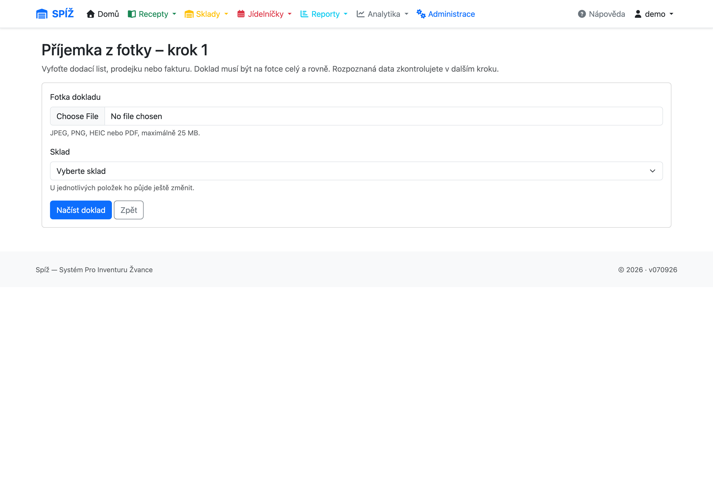
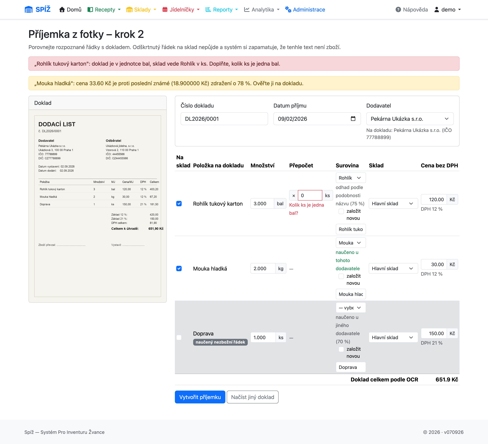
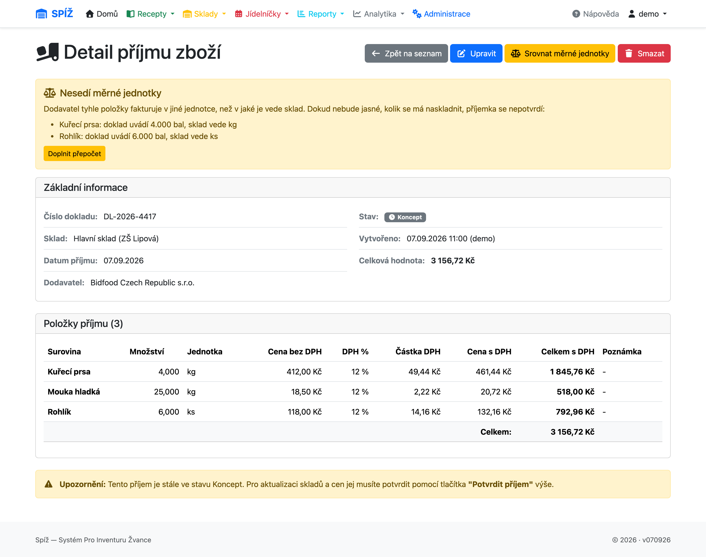
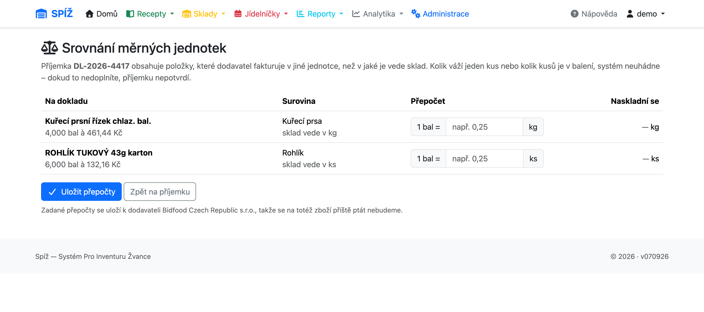

# 4. Příjem zboží

Příjemka je jediná cesta, jak do systému dostat zboží **s cenou**. Vše ostatní (výdejky, odpisy, kalkulace) z cen zavedených příjemkami vychází — proto se vyplatí příjemky dělat pečlivě.

## Jak příjemka funguje

Příjemka prochází dvěma stavy:

```text
KONCEPT (DRAFT) ──[Potvrdit]──► POTVRZENO (CONFIRMED)
   volně editovatelná             už nelze měnit
   sklad nezměněn                 sklad navýšen, ceny zapsány
```

Dokud je příjemka koncept, můžete položky přidávat, mazat i opravovat — sklad se ničeho nedotkne. Teprve **Potvrzení** provede naráz:

1. u každé položky navýší množství na skladové kartě (kartu založí, pokud neexistuje),
2. zapíše novou cenu a sazbu DPH na skladovou kartu,
3. každou změnu ceny uloží do **cenové historie**,
4. příjemku zamkne proti dalším úpravám.

💡 **Proč dvoufázově:** Dodací list se přepisuje po položkách a člověk dělá chyby. Koncept umožňuje doklad v klidu zkontrolovat (součty proti faktuře) a teprve pak jedním krokem promítnout do skladu. Potvrzený doklad je účetní stopa — proto už nejde editovat; chybu opravíte opravným dokladem (odpis/nová příjemka), ne přepsáním historie.

💡 **Jak se počítá nová cena na skladě:** Potvrzením se skladová cena **přepíše cenou z příjemky** (platí poslední nákupní cena). Vážený průměr se používá jen u převodek mezi sklady (kapitola [5](05-sklady-a-prevodky.md)). Stará cena nezmizí — zůstává v cenové historii pro zpětné kalkulace.

## Vytvoření příjemky krok za krokem

**Sklady → Příjmy zboží → Nový příjem** (`/inventory/goods-receipts/create/`).


1. **Číslo dokladu** — opište číslo dodacího listu nebo faktury; slouží k pozdějšímu dohledání.
2. **Sklad**, **datum příjmu** a **dodavatel**.
3. **Položky**: surovina, množství (ve skladové jednotce!), cena a DPH. Cenu lze zadat bez DPH (systém dopočte s DPH) nebo s DPH — dopočítává se vždy druhá hodnota podle sazby (0/12/21 %).
4. Uložit jako koncept → zkontrolovat → **Potvrdit**.


⚠️ **Pozor na jednotky:** Množství je vždy ve **skladové** jednotce suroviny (kg, l, ks). Dodák uvádí „10 × 5 kg mouka“ → zadáváte 50 (kg), ne 10 (balení).

⚠️ **Pozor na ceny:** Překlep v ceně se potvrzením propíše do skladu a do všech kalkulací. Před potvrzením porovnejte celkovou hodnotu příjemky s fakturou — je vidět v detailu dokladu.

## Dodavatelé a šablony položek

Časté dodavatele založí správce v systému (včetně barvy a ikony tlačítka a **IČO**, podle kterého se dodavatel páruje s dokladem). Katalog obsahuje reálné dodavatele — **Bidfood, Makro, Bolero, DK Open** — a doplňuje se podle potřeby provozu. Každému dodavateli lze připravit **šablonu položek** — seznam surovin s výchozí cenou a DPH v obvyklém pořadí dodacího listu.

Při vytváření příjemky pak stačí kliknout na tlačítko dodavatele (např. **Zelinář**) a formulář se předvyplní jeho šablonou — jen upravíte množství a případně ceny podle skutečného závozu.

💡 **Proč to tak je:** Týdenní závoz od stejného dodavatele obsahuje z 90 % stejné položky. Šablona šetří přepisování a hlavně snižuje riziko záměny suroviny (mouka hladká vs. hrubá) — pořadí kopíruje dodací list.

⚠️ **Pozor:** Dodavatel v katalogu není jen ozdoba. Podle názvu a **IČO** k němu systém přiřadí naskenovaný doklad — a co se u dokladu naučí (párování názvů, přepočty jednotek), uloží si právě k němu. Doklad bez přiřazeného dodavatele se nenaučí nic a příště začínáte od nuly.

## Importy dokladů

Kromě ručního zadání umí systém příjemky importovat třemi způsoby:

* **Z fotky dokladu** (`Sklady → Příjmy zboží → Načíst z fotky dokladu`) — vyfotíte dodací list a systém z něj přečte položky. Popsáno níže.
* **Bidfood XML** (`Sklady → Import Bidfood`) — třífázový průvodce: nahrání XML → náhled s párováním surovin → vytvoření příjemky (konceptu). Chybějící suroviny umí založit.
* **CSV dodavatele** (`Sklady → Import CSV`) — obdobný průvodce pro dodavatele, kteří posílají dodací listy v CSV.

Import vždy končí **konceptem** příjemky — kontrola a potvrzení zůstávají na vás, stejně jako u ručního zadání.

## Příjemka z fotky dokladu

Většina dodavatelů posílá papír, ne datový soubor. Místo přepisování dodacího listu po položkách ho můžete **vyfotit** a nechat systém přečíst (`/inventory/photo-import/`). Průvodce má tři kroky.

### Krok 1: Nahrání fotky

Vyberete soubor a **sklad**, na který se bude naskladňovat (u jednotlivých položek ho půjde ještě změnit).

* Formáty: **JPEG, PNG, HEIC nebo PDF**, maximálně **25 MB**. HEIC z iPhonu systém převede sám.
* Fotka musí zachytit doklad **celý a rovně** — useknutý okraj znamená useknuté položky.
* Fotka se před odesláním zmenší; posílá se zmenšená podoba, ne originál z fotoaparátu.



⚠️ **Pozor:** Pokud se místo formuláře objeví hláška „Rozpoznávání dokladů není nastavené", chybí systému přístupový klíč ke službě OCR. Doplní ho správce (kapitola [11](11-sprava-systemu.md)); do té doby zadávejte doklady ručně.

### Krok 2: Kontrola rozpoznaných dat

Nejdůležitější krok. Vlevo je **náhled dokladu**, vpravo tabulka rozpoznaných řádků — porovnáváte je proti sobě, aniž byste přepínali okna. Kliknutím se náhled otevře ve větším.



Nahoře je hlavička: **číslo dokladu**, **datum příjmu** a **dodavatel** (systém ho hledá podle názvu i IČO z dokladu; když netrefí, vyberete ho ručně).

Každý řádek tabulky obsahuje:

| Sloupec | Co s ním |
|---|---|
| **Na sklad** | Zaškrtnutý řádek se naskladní. Odškrtnutím řádek vynecháte — a systém si zapamatuje, že tenhle text není zboží |
| **Položka na dokladu** | Text tak, jak ho přečetlo OCR (needitovatelný) |
| **Množství** | Rozpoznané množství v jednotce z dokladu — přepište, když OCR uhádlo špatně |
| **Přepočet** | Objeví se, jen když se jednotka z dokladu liší od skladové jednotky suroviny (viz níže) |
| **Surovina** | Navržená surovina se štítkem, odkud návrh pochází. Lze vybrat jinou nebo zaškrtnout **založit novou** a rovnou ji vytvořit |
| **Sklad** | Předvyplněný z kroku 1, u položky lze změnit |
| **Cena bez DPH** | Editovatelná; pod ní sazba DPH |

Pod tabulkou je součet dokladu podle OCR — porovnejte ho s papírem, je to nejrychlejší kontrola, jestli se něco neztratilo.

💡 **Proč se doprava a obaly odškrtnou samy:** Na dodacím listu bývají řádky, které nejsou zboží — doprava, vratné obaly, zaokrouhlení. Systém je pozná podle obecných pravidel a rovnou je odškrtne s vysvětlujícím štítkem. Kdyby se naskladnily, vznikly by ve skladu nesmyslné „suroviny" a rozhodily by kalkulace.

#### Varování v kroku 2

Systém sám nic neblokuje, jen upozorní na to, co z dokladu nepozná:

* **„Tenhle doklad už v systému je"** — příjemka se stejným číslem od stejného dodavatele už existuje, s odkazem na ni. Ověřte, že nenaskladňujete jeden dodák podruhé.
* **Nesedící měrná jednotka** (červeně) — doklad je v jiné jednotce než sklad, je potřeba doplnit přepočet.
* **Odchylka ceny** — cena se výrazně liší od poslední známé ceny suroviny na daném skladu. Buď dodavatel zdražil, nebo OCR přečetlo špatné číslo.

⚠️ **Pozor:** Doklady bez vytištěné ceny (typicky rozvozový list řidiče místo dodacího listu) předvyplní systém **nulou**. Cenu dopište ručně — jinak se surovina naskladní zdarma a všechny kalkulace, kde vystupuje, půjdou dolů.

### Krok 3: Vytvoření příjemky

Tlačítkem **Vytvořit příjemku** vznikne **koncept** se zaškrtnutými řádky. Odtud pokračujete stejně jako u ručně zadané příjemky: zkontrolovat součty proti faktuře a **potvrdit**.

Zároveň si systém zapamatuje, co jste vybrali — příště bude u stejného dodavatele hádat lépe (viz níže).

💡 **Proč OCR nepotvrzuje příjemku samo:** Rozpoznaná data jsou návrh, ne pravda. Potvrzením se ceny propíšou do skladu, do cenové historie a do všech kalkulací — a potvrzený doklad už nejde editovat. Kontrola člověkem je proto poslední místo, kde se překlep dá chytit zadarmo.

💡 **Co se stane s fotkou:** Fotka je pracovní materiál ke kontrole při zadávání. Po potvrzení příjemky se **maže**, rozpoznaná data a přepis dokladu ale zůstávají natrvalo — když se za měsíc nesejde sklad, jde z nich zjistit, co systém z dokladu přečetl. Nedokončené importy vyprší po lhůtě, kterou nastaví správce (výchozí 7 dnů).

## Když nesedí měrné jednotky

Dodavatel fakturuje, jak se mu hodí — mouku po pytlích, rohlíky po kartonech. Sklad ale vede každou surovinu v jedné jednotce. Systém proto rozlišuje dva případy:

* **Jednoznačný převod** (kg ↔ g, l ↔ ml) — poměr je daný fyzikou, systém ho provede sám.
* **Nejednoznačný převod** (ks → kg, bal → ks) — kolik váží jeden kus nebo kolik kusů je v balení ví jenom člověk. Tady se systém **musí zeptat**.

Dokud takový přepočet chybí, **příjemku nelze potvrdit**. V detailu příjemky svítí žluté upozornění *„Nesedí měrné jednotky"* se seznamem dotčených položek a místo tlačítka Potvrdit je tlačítko **Srovnat měrné jednotky**.



Na obrazovce **Srovnání měrných jednotek** vyplníte u každé položky jediné číslo: kolik skladových jednotek je **jedna** jednotka z dokladu (`1 bal = ? kg`). Vedle se rovnou dopočítá, kolik se naskladní — je hned vidět, jestli číslo dává smysl.



⚠️ **Pozor:** Přepočet musí být **kladné číslo**. Prázdné pole znamená „nevyplněno", ne jedničku — systém takový řádek nepustí dál. Číslo 1 je platná odpověď (jedno balení = jeden kilogram) a lze ji zadat i tam, kde jednotky na první pohled nesouvisejí.

💡 **Proč to blokuje potvrzení:** Naskladnit „10" místo „250 kg" je chyba, která se nijak neprojeví — dokud za dva měsíce nevyjde inventura a nikdo už nedohledá proč. Zeptat se jednou při příjmu stojí deset vteřin.

Zadaný přepočet se uloží nejen k položce, ale i k **dodavateli** — na totéž zboží se systém podruhé neptá. Příjemka bez přiřazeného dodavatele si přepočet nezapamatuje, na což obrazovka upozorní.

## Jak se systém učí názvy dodavatelů

Dodavatelé si zboží pojmenovávají po svém a stejnou surovinu píšou pokaždé trochu jinak. Systém si proto pamatuje, jak jste rozhodli minule.

U navržené suroviny je vždy vidět **štítek, odkud návrh pochází**:

| Štítek | Znamená | Zeleně = předvyplněno |
|---|---|---|
| naučeno u tohoto dodavatele | Mapování už někdo potvrdil u téhož dodavatele | ano |
| naučeno u tohoto dodavatele (jiná varianta názvu) | Totéž zboží, jen jiná gramáž nebo země původu | ano |
| naučeno globálně | Naučeno u jiného dodavatele, ale název sedí přesně | ano |
| naučeno u jiného dodavatele | Jen návrh, potvrdit musí člověk | ne |
| odhad podle podobnosti názvu | Nejméně jistá vrstva, u návrhu je i procento shody | ne |
| nezbožní řádek podle obecného pravidla | Doprava, obaly, zaokrouhlení — řádek je odškrtnutý | — |
| nerozpoznáno | Vyberte surovinu ručně | ne |

💡 **Proč se to učí, místo aby to pokaždé hádalo:** Samotné porovnávání podobnosti názvů se nic nenaučí — pátý dodák od stejného dodavatele by dopadl stejně špatně jako první. Potvrzené mapování se proto uloží a příště se předvyplní jako hotová věc. **První doklad od nového dodavatele je ruční práce, druhý už z velké části sedí sám.**

⚠️ **Pozor:** Naučené mapování se předvyplní zeleně a je snadné ho odklikat bez čtení. Když se dodavateli změní sortiment (jiný výrobce pod stejným názvem), zůstane naučené staré párování — proto zelené řádky aspoň přelétněte.

Když systém navrhne trvale špatnou surovinu, opraví se to smazáním naučeného aliasu v Django adminu (kapitola [11](11-sprava-systemu.md)). Smazání aliasu jen zapomene pravidlo, na už zapsané doklady nesahá.

## Cenová historie

Každá změna skladové ceny (potvrzením příjemky, inventurou, převodkou) vytvoří záznam v cenové historii suroviny: *sklad, cena, platnost od*. Historii využívá:

* kalkulace ceny porce k datu (kapitola [3](03-suroviny-a-receptury.md)),
* analytika vývoje cen receptů (kapitola [10](10-analytika-a-reporty.md)).

💡 **Proč to tak je:** Bez historie by šlo říct jen „kolik stojí porce dnes“. S historií systém odpoví i „kolik stála v lednu“ a „o kolik zdražil guláš za půl roku“ — což je přesně to, co vedoucí jídelny potřebuje při úpravě cen obědů.

## Časté chyby a jak se jim vyhnout

| Situace | Příčina | Řešení |
|---|---|---|
| *„Sklad je uzamčen kvůli probíhající inventuře“* při potvrzení | Na skladu běží inventura | Počkat na dokončení inventury, pak potvrdit (koncept zůstává uložen) |
| Potvrzená příjemka má chybnou cenu | Překlep, pozdě odhalený | Neopravovat „nasilu“ — vytvořit novou příjemku/odpis dle povahy chyby; cena se srovná dalším závozem |
| Po importu chybí surovina | Nový artikl dodavatele | Import ji nabídne založit; zkontrolujte jednotky a převodní koeficient |
| Kalkulace porce vychází nulová | Surovina ještě neprošla příjemkou | Naskladnit první příjemkou — do té doby má cena hodnotu 0 |
| *„Rozpoznávání dokladů není nastavené"* | Systém nemá klíč ke službě OCR | Zadat doklad ručně; klíč doplní správce (kapitola [11](11-sprava-systemu.md)) |
| *„Doklad se nepodařilo zpracovat"* | Nečitelná, oříznutá nebo šikmá fotka | Vyfotit doklad celý, rovně a za světla |
| *„Session vypršela. Začněte znovu."* | Průvodce importem přerušen dlouhou pauzou | Začít od kroku 1 — nic nevzniklo, příjemka se zakládá až posledním krokem |
| Příjemku nejde potvrdit, svítí *„Nesedí měrné jednotky"* | Doklad je v jiné jednotce než sklad | **Srovnat měrné jednotky** a doplnit přepočet |
| Import navrhl u položky špatnou surovinu | Naučené párování míří jinam | Vybrat správnou surovinu ručně (systém se přeučí); trvale opravit smazáním aliasu v adminu |
| Položka z fotky se naskladnila za nulu | Doklad neměl vytištěnou cenu | Cenu doplnit na kroku 2 importu; už potvrzenou příjemku srovnat dalším závozem |

---

*Technická poznámka pro vývojáře: `GoodsReceipt.confirm()` (`apps/inventory/models.py`) běží v `transaction.atomic`; cena z položky přepisuje `StockItem.price` a `IngredientPriceHistory` se plní signálem v `StockItem.save()`. Položka `GoodsReceiptItem.calculate_vat_fields()` dopočítává trojici bez DPH / DPH / s DPH. Šablony: `Supplier` (včetně `ico`), `SupplierIngredientTemplate` (cache přes `template_cache_key`); reálný katalog zavádí datová migrace `0028_create_real_suppliers`. Ceny se ukládají na šest desetinných míst — cena za skladovou jednotku vzniká dělením ceny za balení a při dvou místech se drobné položky zaokrouhlily na nulu.*

*Import z fotky: průvodce `photo_import_step1/2/3` a náhled skenu `photo_import_scan` v `apps/inventory/views.py`, balík `apps/inventory/ocr/` (`client` — `prepare_image`/`run_ocr`/`OcrError`, `normalize.to_receipt_data`, `quirks.classify_line` pro nezbožní řádky, `storage` — `save_scan`/`delete_scan`/`maybe_purge`). Rozpracovaná data drží session (`photo_receipt_data`, `photo_default_warehouse`, `photo_scan_id`), sken model `GoodsReceiptScan` (`delete_file()` maže fotku, `annotation` a `markdown` zůstávají). Neblokující pojistky kroku 2: `apps/inventory/receipt_checks.py` (`check_duplicate_receipt`, `check_price_deviation`, `check_price_precision`) přes `_collect_import_warnings()`. Párování názvů: `IngredientResolver` v `apps/inventory/matching.py` (sedm vrstev, `AUTOMATIC_SOURCES` se předvyplní, `FUZZY_THRESHOLD = 0.4`, `remember()` učí), alias `SupplierItemAlias`, normalizace názvů `apps/inventory/naming.py`. Jednotky: `apps/inventory/units.py` (`UNIT_SCALES`, `UNIT_FAMILIES`, `conversion_factor`), konflikt hlídá `GoodsReceiptItem.has_unit_conflict` / `GoodsReceipt.unit_conflicts`, řeší view `goods_receipt_resolve_units`. Nastavení `MISTRAL_API_KEY`, `MISTRAL_OCR_MODEL`, `OCR_SCAN_RETENTION_DAYS`; testy nad fixtures `test/fixtures/ocr/` nesahají na síť.*
