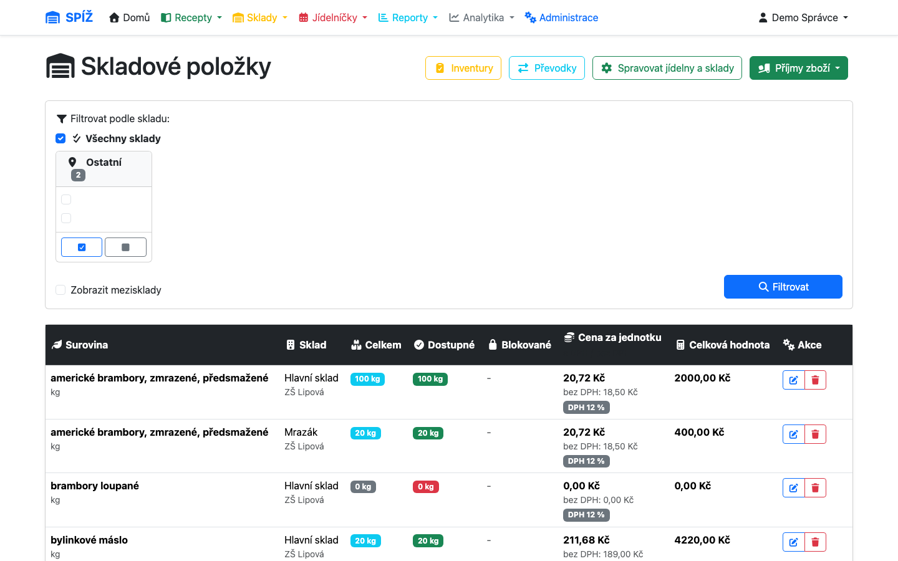
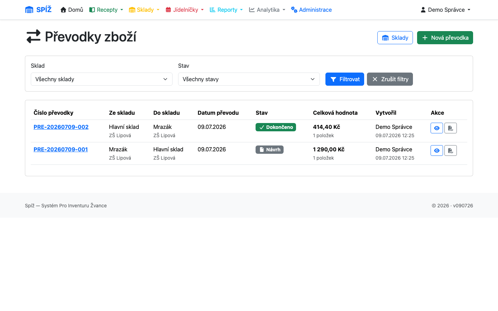
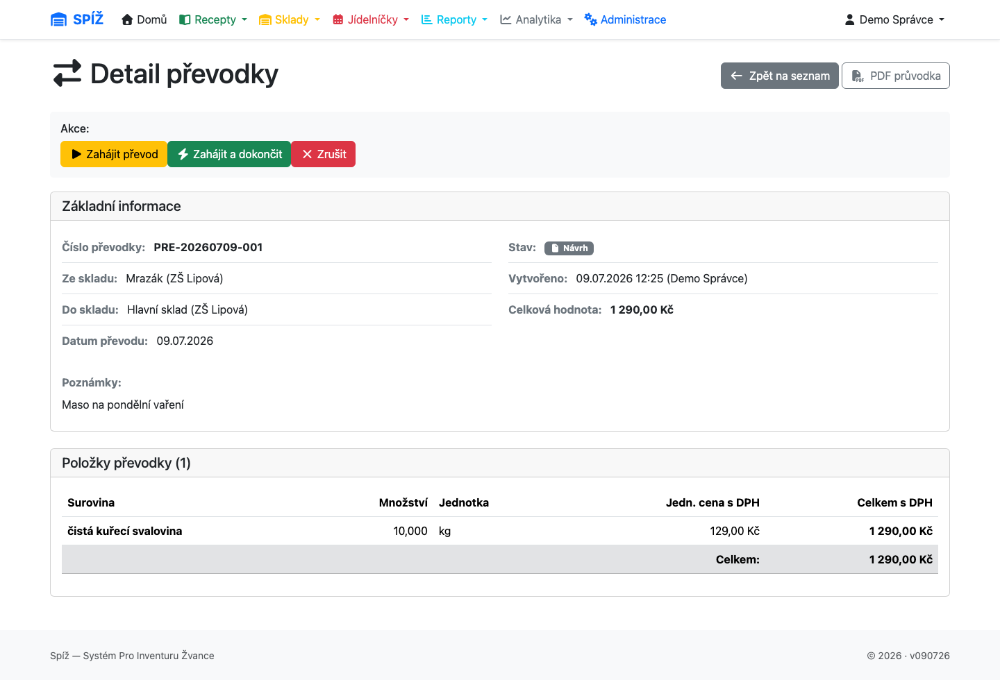

# 5. Sklady a převodky

## Skladová karta

Přehled zásob najdete v **Sklady → Zobrazit zásoby** (`/inventory/`), s filtrem podle skladu.



Každá karta (surovina × sklad) nese:

* **Množství** (`quantity`) — fyzický stav ve skladové jednotce.
* **Blokováno** (`quantity_blocked`) — množství rezervované připravovanými výdejkami (kapitola [8](08-vydejky.md)).
* **Dostupné** = množství − blokováno. Proti dostupnému množství se kontrolují převodky a výdeje.
* **Cenu s DPH**, **sazbu DPH** a dopočtenou **cenu bez DPH** — vždy za skladovou jednotku, dle poslední příjemky.

💡 **Proč blokace:** Když kuchařka připraví výdejku na zítřek, zboží je stále fyzicky na skladě — ale nesmí ho „přebrat“ jiná výdejka nebo převodka. Blokace odděluje *fyzicky na skladě* od *k dispozici*, aniž by se hýbalo se stavem.

⚠️ **Pozor:** Ruční editace skladové karty (množství/ceny mimo doklady) je nouzový nástroj správce — nevytváří doklad ani auditní stopu. Běžné korekce dělejte inventurou, odpisem nebo příjemkou.

## Převodky

Převodka přesouvá zboží mezi sklady (např. z mrazáku do hlavního skladu). Najdete je v **Sklady → Převodky** (`/inventory/stock-transfers/`).



### Workflow

```text
NÁVRH (DRAFT) ──[Zahájit]──► V PŘEVOZU (IN_TRANSIT) ──[Dokončit]──► DOKONČENO (COMPLETED)
      │                            │
      └────────[Zrušit]────────────┴──────► ZRUŠENO (CANCELLED)
```

* **Návrh** — doklad se sestavuje, sklad se ničeho nedotkl. Lze volně editovat i smazat.
* **Zahájení** — zboží se odečte ze zdrojového skladu a přesune do **meziskladu** jídelny. Kontroluje se dostupné množství a zámky skladů.
* **Dokončení** — zboží se přesune z meziskladu do cílového skladu; tam se přepočítá cena váženým průměrem (viz níže).
* **Zrušení** — z návrhu jen změní stav; z „v převozu“ vrátí zboží z meziskladu zpět do zdroje.

Pro rychlé přesuny nabízí systém tlačítko **Zahájit a dokončit** — provede oba kroky naráz a mezisklad přeskočí. Hodí se pro převody „přes chodbu“ v rámci jedné budovy.



💡 **Proč mezisklad:** Mezi zahájením a dokončením je zboží fyzicky „na cestě“ — už není ve zdroji, ještě není v cíli. Kdyby systém zboží nechal ve zdroji do dokončení, mohl by ho někdo mezitím vydat (a převodka by při dokončení sáhla do prázdna); kdyby ho připsal do cíle hned, cílový sklad by vykazoval zboží, které tam ještě fyzicky není — a inventura by nevyšla. Mezisklad dělá stav „v převozu“ viditelný a auditovatelný. Je jeden na jídelnu, systém ho spravuje sám a přímo na něj převádět nelze.

### Vážený průměr ceny v cíli

Pokud cílový sklad už surovinu má (za jinou cenu), dokončení převodky přepočítá cenu **váženým průměrem**:

```text
nová cena = (staré množství × stará cena + převáděné množství × cena z převodky)
            ─────────────────────────────────────────────────────────────────
                        staré množství + převáděné množství

Příklad: v cíli 10 kg à 20 Kč, převádím 5 kg à 26 Kč
nová cena = (10×20 + 5×26) / 15 = 330/15 = 22 Kč/kg
```

💡 **Proč průměr, a ne poslední cena:** U příjemky nová dodávka reprezentuje aktuální nákupní cenu — přepsat ji dává smysl. U převodky se ale jen slévá stejné zboží nakoupené za různé ceny; průměr zachová celkovou hodnotu zásoby (15 kg za 330 Kč), takže „papírová“ hodnota skladů se převodem nezmění.

### Číslování a mazání

* Převodky se číslují automaticky: `PRE-RRRRMMDD-NNN` (datum + pořadí v rámci dne). Číslo přiděluje systém, kolize hlídá databáze.
* **Bezpečně smazat lze pouze NÁVRH** — ještě nehnul skladem, položky se smažou s ním. Převodky V PŘEVOZU a DOKONČENÉ nikdy nemažte (ani přes Django admin!) — sklad by zůstal nekonzistentní. Použijte **Zrušit**, které zboží řádně vrátí.

### Omezení a validace

Systém odmítne:

* převod ze skladu do téhož skladu,
* převod z/do meziskladu napřímo,
* zahájení či dokončení, je-li kterýkoli z dotčených skladů (včetně meziskladu) **zamčen inventurou**,
* zahájení, není-li ve zdroji dostatek **dostupného** množství (hláška uvádí, kolik je k dispozici a kolik požadujete).

⚠️ **Pozor — zapomenuté převodky „v převozu“:** Zboží v meziskladu není vidět v běžných přehledech a nejde vydat. Pokud v seznamu visí převodka V PŘEVOZU déle než je zdrávo, buď ji dokončete, nebo zrušte — jinak vám zboží „zmizí“ z dostupných zásob a bude chybět při inventuře zdroje i cíle.

---

*Technická poznámka pro vývojáře: `StockTransfer.start_transfer()/complete_transfer()/start_and_complete()/cancel()` v `apps/inventory/models.py`, vše atomicky se `select_for_update()` na skladových kartách. Vážený průměr: `_add_to_stock_with_average_price()`. Mezisklad: `Canteen.get_or_create_transit_warehouse()`. Číslování `_generate_transfer_number()` parsuje čísla jako integery (řazení stringů selhává od 1000) a kolize řeší unique constraintem.*
