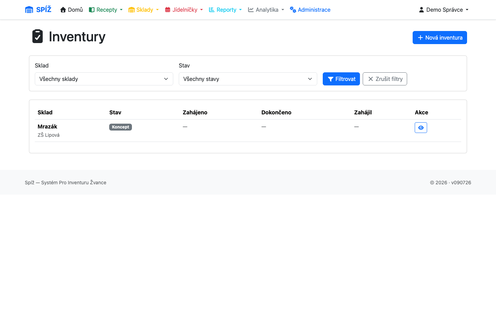

# 6. Inventura

Inventura srovnává systémový stav skladu s fyzickou realitou. Ve SPÍŽi je to řízený proces, který po dobu počítání sklad zamkne a na konci hromadně opraví stavy.

## Workflow

```text
NÁVRH (DRAFT) ──[Zahájit]──► PROBÍHÁ (IN_PROGRESS) ──[Dokončit]──► DOKONČENO (COMPLETED)
                                   │
                                   └────[Zrušit]────► ZRUŠENO (CANCELLED)
```

Inventury najdete v **Sklady → Inventury** (`/inventory/inventory-verifications/`).



### 1. Založení (návrh)

Vyberete sklad a založíte inventuru. Návrh ještě nic nezamyká — jen říká „chystáme se počítat“.

### 2. Zahájení

Kliknutím na **Zahájit** systém:

1. **zamkne sklad** — od této chvíle na něm nelze přijímat, vydávat, převádět ani odepisovat,
2. vyfotí aktuální stav: pro každou skladovou kartu vytvoří řádek inventury se **systémovým množstvím**,
3. zapamatuje si, kdo a kdy inventuru zahájil.

⚠️ **Pozor:** Zahajujte inventuru až ve chvíli, kdy opravdu jdete počítat, a mimo dobu příjmu/výdeje. Zamčený sklad blokuje práci všem — včetně výdeje na vaření.

### 3. Počítání

Do řádků zapisujete **spočtené množství**. Systém průběžně ukazuje rozdíl (spočteno − systém). Najdete-li na skladě zboží, které systém vůbec neeviduje, přidáte ho jako **nově nalezenou položku**.

⚠️ **Pozor:** Dokončit nelze, dokud má některý řádek prázdné spočtené množství. „Nic jsme nenašli“ se zapisuje jako **0**, ne jako prázdné pole — prázdné pole znamená „ještě nespočteno“ a systém dokončení odmítne.

#### Vynulovat sklad

Pokud provoz na konci turnusu vyprodá celý sklad do nuly, nemusíte zadávat 0 ručně do každé položky. Na stránce počítání je tlačítko **Vynulovat sklad** — po potvrzení nastaví spočtené množství na 0 u úplně všech položek (i těch, které jste už stihli ručně vyplnit) a inventuru rovnou dokončí.

⚠️ **Pozor:** Tuto akci nelze vzít zpět. Použijte ji jen tehdy, když je sklad opravdu prázdný — jinak přijdete o rozpracované počítání a systém následně bude ukazovat manko u všeho, co ve skutečnosti na skladě zbylo.

### 4. Dokončení

Kliknutím na **Dokončit** systém v jedné transakci:

1. přepíše skladové karty spočtenými hodnotami (nově nalezené položky založí),
2. spočte a uloží rozdíly (manka a přebytky zůstávají v inventuře k pozdějšímu dohledání),
3. **odemkne sklad**,
4. zaznamená, kdo a kdy dokončil.

💡 **Proč zámek po celou dobu:** Inventura má smysl, jen pokud se během počítání stav nemění. Jediný příjem nebo výdej „pod rukama“ znehodnotí všechny rozdíly — nešlo by rozlišit skutečné manko od legitimního pohybu. Proto zámek drží od zahájení do dokončení a nejde obejít žádnou operací.

### Zrušení

Probíhající inventuru lze **zrušit** — sklad se odemkne a stavy zůstanou beze změny (spočtené hodnoty se nikam nepropíší). Zrušit ji smí **jen ten, kdo ji zahájil, nebo správce**.

💡 **Proč to omezení:** Zrušení zahazuje rozpracované počítání. Omezení na autora brání tomu, aby kdokoli „odblokoval sklad“ a tím kolegovi zahodil hodinu práce ve skladu.

## Co dělat, když inventura „visí“

Typický scénář: kolega zahájil inventuru, odešel a sklad zůstal zamčený.

1. V **Sklady → Inventury** najděte inventuru ve stavu PROBÍHÁ — je u ní vidět, kdo ji zahájil.
2. Kontaktujte ho, ať dokončí nebo zruší.
3. Není-li dostupný, inventuru zruší **správce** (superuser) — sklad se odemkne, žádná data se neztratí kromě rozpracovaného počítání.

⚠️ **Pozor:** Nikdy neřešte zamčený sklad zásahem do databáze nebo Django adminu (ruční přepnutí `is_locked`). Zámek je svázán s inventurou; rozpojení vede k inventuře, kterou nejde ani dokončit, ani zrušit. Vždy jděte cestou zrušení inventury v aplikaci.

## Doporučený postup pro hladkou inventuru

1. Dokončete či zrušte rozpracované doklady na skladu (koncepty příjemek počkají — jen je nepůjde potvrdit).
2. Dokončete převodky „v převozu“, které se skladu týkají — zboží v meziskladu byste jinak počítali dvakrát nebo vůbec.
3. Zahajte inventuru, počítejte, zapisujte průběžně.
4. Před dokončením zkontrolujte řádky s velkými rozdíly — nejčastěji jde o překlep nebo záměnu jednotek (kg vs. ks).
5. Dokončete. Rozdíly zůstávají uloženy v inventuře pro pozdější analýzu.

---

*Technická poznámka pro vývojáře: `InventoryVerification.start()/complete()/cancel()/zero_out_and_complete()` v `apps/inventory/models.py`, atomicky se `select_for_update()`. Zámek: `Warehouse.is_locked` + `locked_by_inventory`. Řádky: `InventoryVerificationItem` (unikátní na dvojici inventura × surovina, `is_newly_found` pro dodatečně nalezené zboží). Validace „všechna pole spočtena“ běží v `complete()`. `zero_out_and_complete()` nastaví všem položkám `counted_quantity = 0` a zavolá `complete()` ve stejné transakci; `complete()` si při dokončení znovu zamkne řádek (`select_for_update`) a ověří stav, aby dva souběžné požadavky nemohly dokončit stejnou inventuru dvakrát.*
