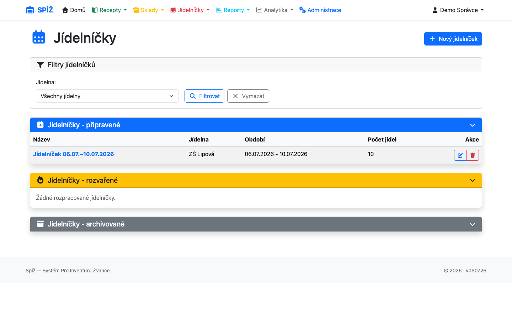
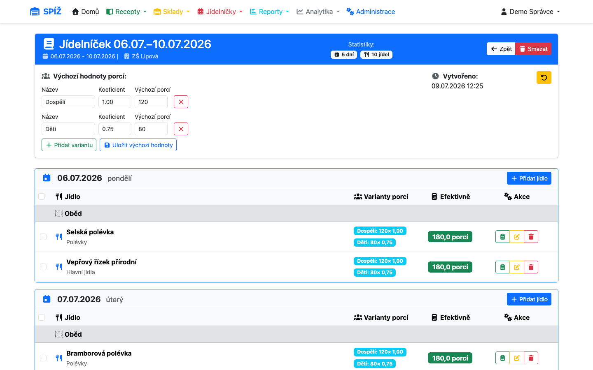
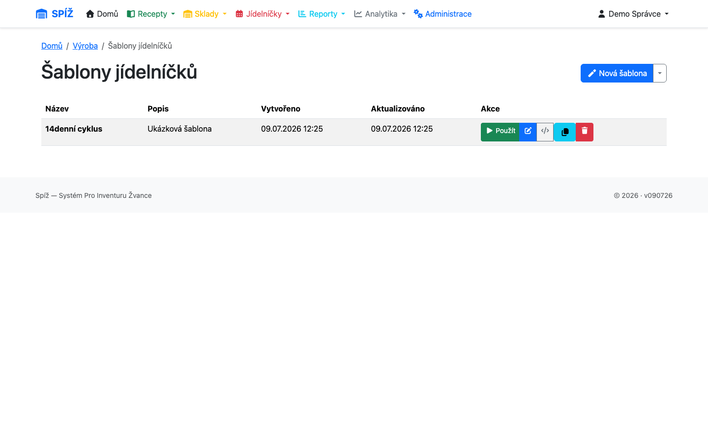
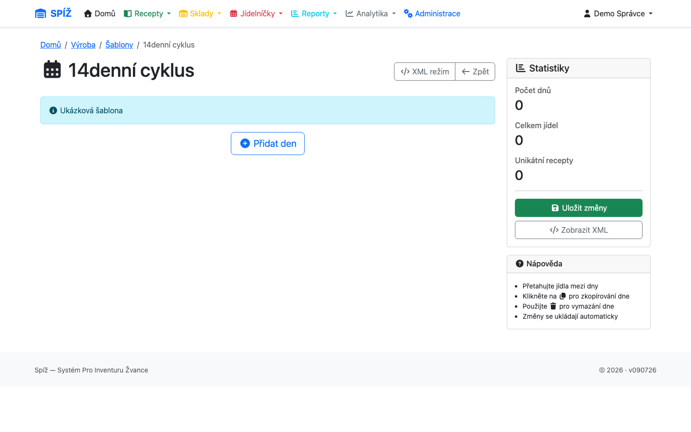
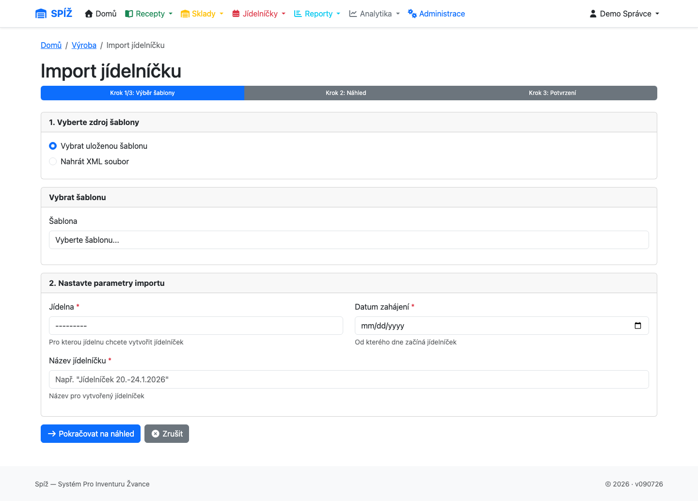

# 7. Jídelníčky a výroba

Jídelníček je plán vaření: která jídla, ve kterých dnech, pro kolik strávníků. Z jídelníčku systém automaticky spočítá potřebu surovin (výdejky, kapitola [8](08-vydejky.md)) i náklady (kapitola [10](10-analytika-a-reporty.md)).

## Jídelní plán

**Jídelníčky → Jídelníčky** (`/production/jidelnicky/`).

Plán má název, jídelnu a rozsah dat (typicky týden). Do každého dne přidáváte **výrobní příkazy** — jedno jídlo = jeden příkaz (recept + typ jídla: snídaně, přesnídávka, oběd, svačina, večeře).

## Varianty porcí a koeficienty

Jedno jídlo se často vaří pro více kategorií strávníků s různě velkou porcí. To řeší **varianty porcí** u každého výrobního příkazu:

| Varianta | Koeficient | Porcí | Efektivní porce |
|---|---|---|---|
| Dospělí | 1,00 | 120 | 120 |
| Děti | 0,75 | 80 | 60 |
| **Celkem k vaření** | | 200 | **180** |

Potřeba surovin se počítá z **efektivních porcí** (porce × koeficient): norma 150 g brambor na porci × 180 efektivních porcí = 27 kg. Vaří se tedy „180 dospělých porcí" rozdělených na 200 talířů.

💡 **Proč koeficienty místo dvou receptů:** Dětská porce je totéž jídlo, jen menší. Kdyby existoval zvláštní recept „guláš dětský", každá úprava receptury by se dělala dvakrát a dřív nebo později by se verze rozešly. Koeficient škáluje jeden recept — a nastavuje se na úrovni jídelníčku (výchozí varianty), takže je u všech jídel konzistentní.

Výchozí varianty (názvy, koeficienty, počty porcí) nastavíte u jídelního plánu; každé jídlo je zdědí a lze je u něj individuálně upravit (např. bufet vaří jen pro dospělé).

## Šablony jídelníčků

Opakující se cykly (14denní jídelníček ŠVP…) uložte jako **šablonu** — **Jídelníčky → Šablony** (`/production/sablony/`).

Šablonu lze editovat dvěma způsoby:

* **Vizuální editor** — přetahování jídel mezi dny (drag & drop), přidávání přes našeptávač receptů, kopírování celých dnů. Změny se ukládají automaticky.
* **XML editor** — přímá úprava XML pro hromadné zásahy.

💡 **Proč šablony odkazují na kódy receptů:** Šablona uchovává kódy (`PO-012`), ne názvy. Recept můžete přejmenovat a šablona dál funguje — proto je kód receptu neměnný (kapitola [3](03-suroviny-a-receptury.md)).

### Tvorba jídelníčku ze šablony

**Jídelníčky → Tvorba ze šablony** (`/production/import-jidelnicku/`) — třífázový průvodce:

1. **Výběr šablony** a data začátku.
2. **Náhled** — vidíte, která jídla na které dny vzniknou, a nastavíte počty porcí variant.
3. **Potvrzení** — vytvoří se jídelní plán se všemi výrobními příkazy a variantami.

⚠️ **Pozor:** Pokud šablona odkazuje na recept, který mezitím někdo smazal, náhled na to upozorní — jídlo přeskočte nebo recept obnovte. Proto recepty raději needitujte „mazáním a zakládáním znovu" — nový recept dostane nový kód a vazba ze šablon se ztratí.

## Úpravy ingrediencí na den (overrides)

Občas je třeba jedno konkrétní vaření upravit: dnes místo čerstvé papriky mražená, bez ořechů kvůli alergikovi, dvojnásobek koření. K tomu slouží **úprava ingrediencí výrobního příkazu** (v detailu jídelníčku u jídla):

* **změna množství** — jiná norma jen pro tento den,
* **odebrání suroviny** — dnes se nepoužije,
* **přidání suroviny** — dnes navíc.

Upravené jídlo je v jídelníčku označené; úpravy lze zkopírovat na jiné dny nebo hromadně vrátit na původní recepturu.

💡 **Proč overrides místo úpravy receptu:** Receptura je trvalá norma — kdyby kuchařka kvůli jednomu dni změnila recept, změna by se propsala do všech budoucích jídelníčků i kalkulací. Override platí jen pro jeden výrobní příkaz; recept zůstává netknutý. Výdejka se generuje už s ohledem na úpravy.

⚠️ **Pozor:** Úpravy dělejte **před** vygenerováním a výdejem výdejky. Změna ingrediencí po výdeji výdejku nepřepočítá zpětně — rozdíl byste museli řešit ručně (doodepsat/vrátit).

---

*Technická poznámka pro vývojáře: Modely v `apps/production/models.py`: `MenuPlan` + `MenuPlanCoefficient` (výchozí varianty), `ProductionOrder` + `ProductionOrderPortionVariant` (`effective_portions = portions × coefficient`), `ProductionOrderIngredientOverride` (`is_added`/`is_removed`/změněná `quantity_per_portion`), `MenuTemplate` (`parse_schedule_to_dict()` ↔ vizuální editor, autosave AJAX). Generování výdejky: `ProductionOrder.generate_picking_list()` respektuje varianty i overrides.*
