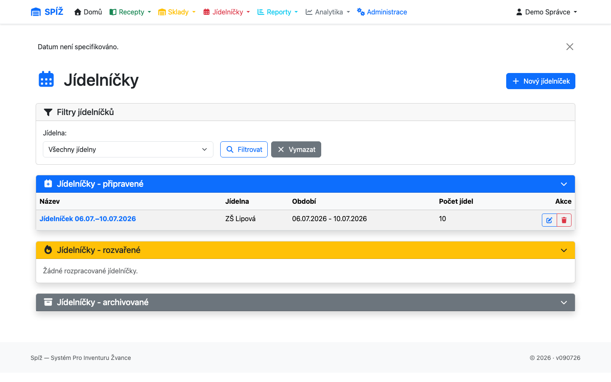
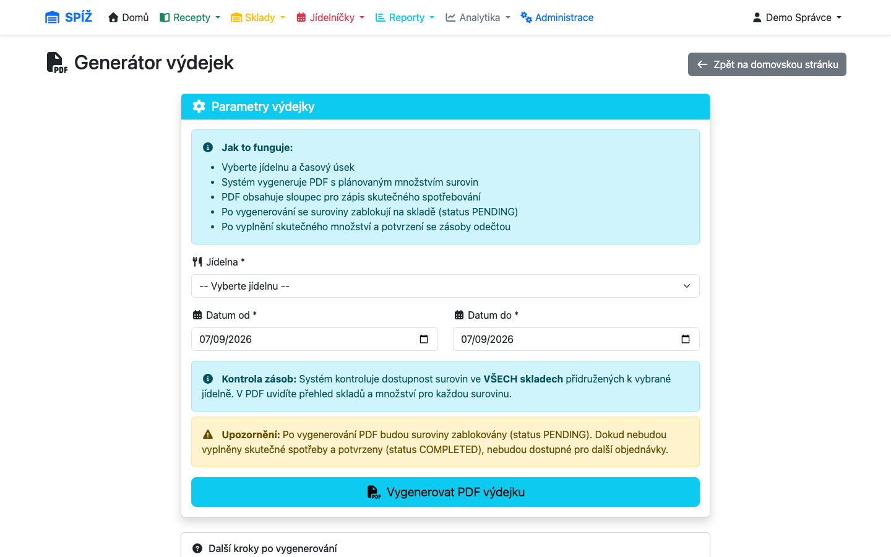

# 8. Výdejky

Výdejka je doklad o výdeji surovin ze skladu do kuchyně na konkrétní vaření. Vzniká automaticky z jídelníčku — systém spočte potřebu podle normy receptu, variant porcí a případných úprav ingrediencí.

## Kde výdejky najdete

* **Výdejka dne** (`/production/vydejka-dne/`) — agregovaný pohled na dnešní potřebu surovin ze všech jídel.
* **Generátor výdejek** (`/production/vydejky/`, menu Reporty → Výdejky) — sestavení výdejkového **dokumentu** za den či rozsah dní, jeho editace, PDF a archivace.




## Životní cyklus položky výdejky

```text
vygenerováno (ČEKÁ / PENDING)
      │  zařazení do výdejkového dokumentu
      ▼
BLOKOVÁNO na skladě (plánované množství)
      │  výdej — zapsání skutečného množství
      ▼
DOKONČENO (COMPLETED): blokace uvolněna, sklad snížen o skutečné množství
      │  (omylem? lze vrátit)
      ▼
vratka: sklad vrácen, položka znovu ČEKÁ s blokací
```

### 1. Generování

Každé jídlo v jídelníčku má vygenerované položky výdejky: surovina, **plánované množství** (norma × efektivní porce, převedeno na skladové jednotky) a sklad, ze kterého se bude vydávat (systém předvyplní sklad jídelny, kde surovina je).

### 2. Blokace

Zařazením položek do výdejkového dokumentu se plánované množství **zablokuje** na skladové kartě. Zboží je stále fyzicky na skladě, ale jiná výdejka ani převodka ho už „nevidí“ jako dostupné.

💡 **Proč blokace, a ne rovnou odečtení:** Výdejka se připravuje dopředu (třeba v pátek na pondělí), ale zboží fyzicky opustí sklad až při vaření. Kdyby se sklad odečetl hned, inventura přes víkend by nevyšla; kdyby se neblokovalo nic, dvě výdejky by si mohly slíbit totéž kilo masa. Blokace odděluje **rezervováno** od **vydáno**.

### 3. Dokončení (výdej)

Při výdeji zapíšete **skutečně vydané množství** (může se od plánu lišit — vážení, zaokrouhlení balení) a položku dokončíte. Systém uvolní blokaci a odečte ze skladu skutečné množství.

### Vratky

Dokončenou položku lze vrátit do stavu ČEKÁ — skutečné množství se vrátí na sklad a plánované se znovu zablokuje. Slouží k opravě omylů (překlep ve vydaném množství, výdej z nesprávného skladu).

## Záporný sklad

Pokud při dokončení není na skladě dost zboží, systém výdej **nezablokuje** — provede ho a skladová karta jde do minusu. Záporné stavy jsou zvýrazněny v přehledech i na PDF výdejky.

💡 **Proč je minus dovolen:** Kuchyně musí uvařit — realita má přednost před evidencí. Zákaz by vedl jen k obcházení systému („vydáme bokem a doklad uděláme potom“, tedy nikdy). Minus je signál, že evidence neodpovídá: buď chybí příjemka/převodka, nebo je špatně norma. Řešte ho co nejdřív — doplněním chybějícího dokladu nebo inventurou.

⚠️ **Pozor:** Opakované minusy u stejné suroviny = systémový problém (špatný převodní koeficient, zapomenutý závoz). Nenechávejte je „vyhnít“ — pokřivují kalkulace cen.

## Výdejkové dokumenty a PDF

Výdejky se seskupují do **dokumentů** (den nebo více dní), které lze:

* **editovat** — upravit plánovaná množství, doplnit skutečná, dokončovat položky,
* **exportovat do PDF** — optimalizováno pro černobílý tisk do kuchyně; u vícedenních dokumentů se generuje po dnech,
* **archivovat** — dokument, jehož všechny položky jsou dokončené, lze archivovat; zmizí z aktivních přehledů, ale zůstává dohledatelný (včetně PDF).

U dokumentu se eviduje i **kuchař** — kdo vaření zajišťoval (využívá analytika kuchařů, kapitola [10](10-analytika-a-reporty.md)).

💡 **Proč se velká PDF generují „po dnech“:** Vícedenní dokument s desítkami jídel by se renderoval celý naráz a spotřeboval příliš mnoho paměti serveru. Nad ~60 jídel proto systém vykreslí každý den zvlášť a stránky spojí — výsledek je stejný, jen se nezahltí server.

## Časté situace

| Situace | Co se děje | Řešení |
|---|---|---|
| *Sklad je uzamčen inventurou* při výdeji | Na skladu běží inventura | Počkat na dokončení / kontaktovat toho, kdo počítá (kapitola [6](06-inventura.md)) |
| Položka jde vydat jen částečně | Skutečné množství < plán | Zapsat skutečnost; zbytek blokace se uvolní dokončením |
| Vydáno z nesprávného skladu | — | Vratka → změna skladu → znovu dokončit |
| Karta suroviny v minusu | Výdej přes nulu | Dohledat chybějící příjemku/převodku, případně srovnat inventurou |
| Nelze archivovat dokument | Některá položka není dokončená | Dokončit či odebrat zbývající položky |

---

*Technická poznámka pro vývojáře: `PickingList.save()` (`apps/production/models.py`) řídí blokace: přiřazení k dokumentu → `block_quantity(quantity_planned)`; přechod na COMPLETED → `unblock` + odečet `quantity_actual`; revert vrací zásobu a znovu blokuje. Dokument: `PickingListDocument` (`can_be_archived()` vyžaduje vše COMPLETED). PDF: `apps/production/utils.py`, `PDF_CHUNK_MEAL_THRESHOLD = 60`, spojování stránek přes pypdf. Validace ve `clean()`: sklad patří jídelně, není zamčen, `quantity_actual` povinné pro COMPLETED.*
