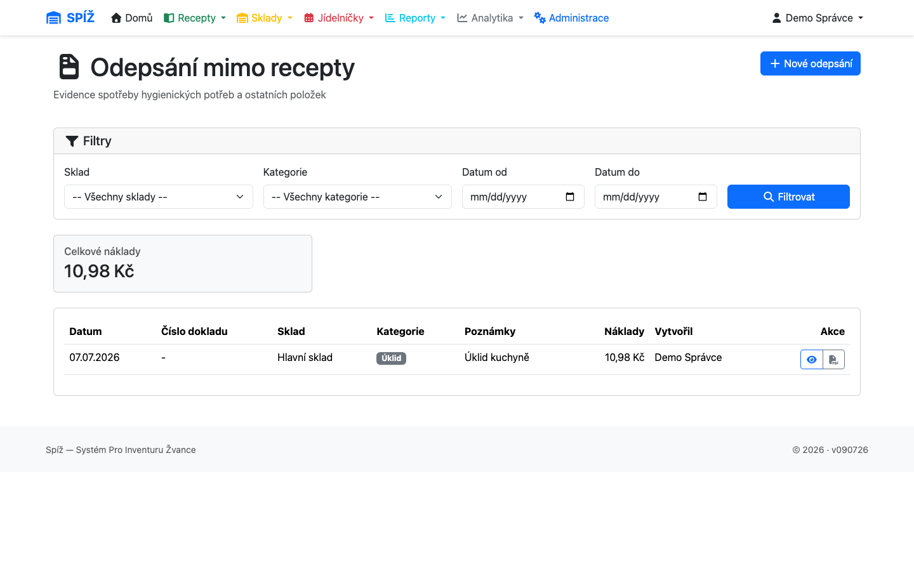
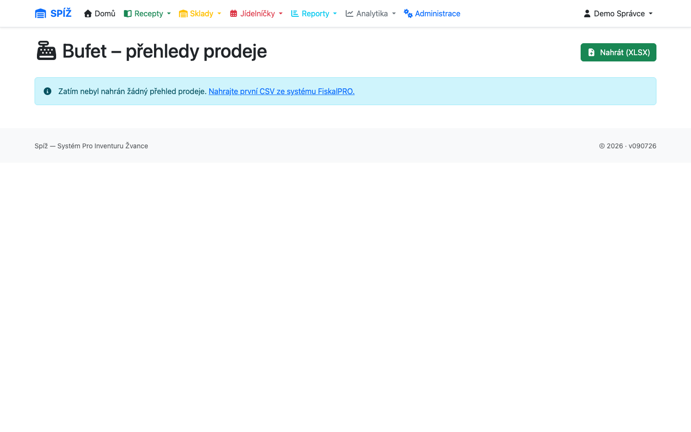
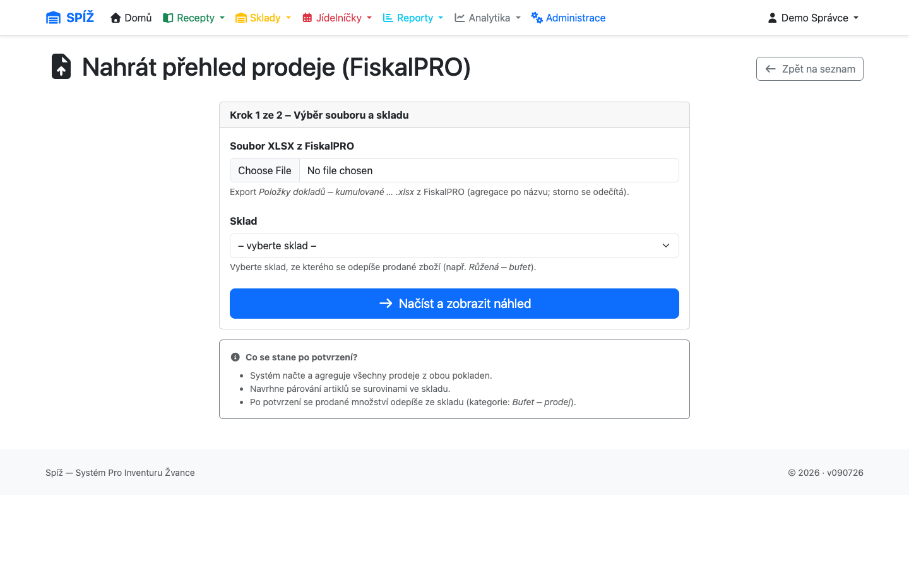
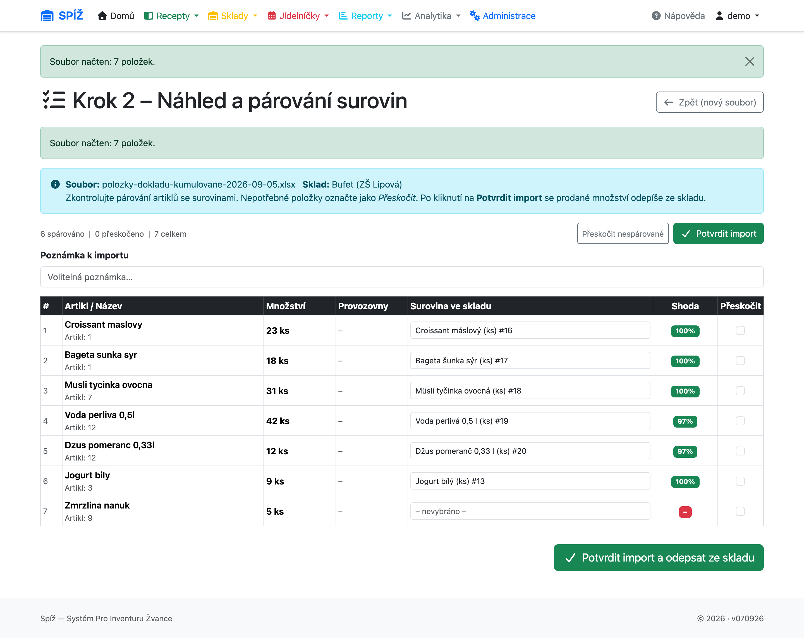

# 9. Odpisy a bufet

Ne všechno zboží opouští sklad kvůli vaření podle receptur. Úklidové prostředky, prádelna, občerstvení personálu nebo prodej v bufetu — to vše řeší **odpisy** a specializovaný modul **Bufet**.

## Odpisy mimo recepty

**Sklady → Odepisování zboží** (`/inventory/write-offs/`).

Odpis je jednoduchý doklad: sklad, datum, **kategorie** a položky (surovina + množství). Kategorie slouží k pozdější analýze nákladů:

* Úklid, Údržba, Prádelna,
* Personál RS, Výchovný personál, Pedagogové,
* Ubytování, Ostatní.

Na rozdíl od výdejek nemá odpis schvalovací workflow — **položky se odepisují ze skladu okamžitě** při uložení. Jednotková cena se v okamžiku odpisu automaticky převezme ze skladové karty, takže analytika umí říct, kolik úklid či svačiny personálu stojí.

💡 **Proč bez workflow:** Odpis je operativa („došel jar, vydej nový") — dvoufázové potvrzování by jen zdržovalo. Auditní stopa zůstává: doklad nese kategorii, autora, datum i cenu v okamžiku odpisu.

**Smazání položky odpisu vrací zboží na sklad.** Omylem odepsanou položku tedy stačí smazat — množství se vrátí. Mazat smí autor dokladu nebo správce.

⚠️ **Pozor:** U položky lze po vytvoření měnit už jen poznámku. Špatné množství se opravuje smazáním položky (vrátí zboží) a vytvořením nové.

## Bufet — import prodejů z pokladny FiskalPRO

Modul Bufet automatizuje odpis zboží prodaného v bufetu: místo ručního přepisování prodejů se nahraje export z pokladního systému **FiskalPRO**.

**Sklady → Bufet – přehledy prodeje** (`/bufet/`).

### Podklad: export z pokladny

Z FiskalPRO vyexportujte přehled **„Položky dokladů – kumulované"** ve formátu XLSX. Systém z něj čte sloupce **Název** (co se prodalo) a **Množství** (kolik kusů), pomocně Artikl a MJ. Ceny, DPH ani skupiny z exportu nepoužívá — náklad se určuje ze skladových cen po spárování. Datum exportu se přebírá z názvu souboru.

### Krok 1: Nahrání souboru

Vyberete XLSX a **sklad bufetu**, ze kterého se prodané zboží odepíše.

Při načtení systém:

* zpracuje jen řádky typu *prodej* a *prodej návrat/storno* (platby a jiné doklady ignoruje),
* **storna odečte** — vrácené zboží snižuje prodané množství; položky s nulovým čistým prodejem vypadnou,
* **sečte prodeje podle názvu zboží**.

💡 **Proč agregace podle názvu, a ne podle artiklu:** V praxi pokladna přiděluje jeden artiklový kód více různým produktům (kód 1 = „Pegas Almond" i „Kinder Bueno"). Název je jediný spolehlivý identifikátor v exportu; tentýž název se navíc v souboru opakuje kvůli různým sazbám DPH a systém řádky správně sloučí.

### Krok 2: Párování se surovinami

Každé prodané zboží je třeba spárovat se **surovinou ve skladu**. Systém navrhne nejpodobnější surovinu podle názvu (bez ohledu na diakritiku a velikost písmen) a barevně označí jistotu shody:

* zeleně ≥ 70 % — návrh téměř jistě sedí, jen zkontrolujte,
* žlutě < 70 % — zkontrolujte pečlivě, případně vyberte ručně,
* červeně — návrh nenalezen, vyberte ze seznamu.

Zboží, které nechcete odepisovat (nebo ve skladu neexistuje), označte **Přeskočit**; tlačítko **Přeskočit nespárované** to udělá hromadně. Počítadlo nahoře průběžně ukazuje spárováno/přeskočeno/celkem.

### Krok 3: Potvrzení

Potvrzením systém:

1. uloží import se všemi položkami (pro pozdější dohledání),
2. vytvoří **odpis** kategorie *prodej bufetu* — množství se sečtou po surovinách (více druhů zboží může vést na tutéž surovinu),
3. odepíše zboží ze skladu bufetu; **cena se převezme ze skladové karty** v okamžiku odpisu.

Položky, pro které není na skladě dost zásoby, systém vyjmenuje ve varování — ostatní se odepíší normálně. Detail importu ukazuje spárování všech položek a odkaz na vzniklý odpis včetně nákladové hodnoty.

⚠️ **Pozor:**

* Import odepisuje **z jednoho skladu** — veďte zboží bufetu na vyhrazeném skladu, ať se prodeje nemíchají se surovinami kuchyně.
* Tentýž export nenahrávejte dvakrát — vznikl by dvojí odpis. Seznam importů ukazuje název souboru a datum exportu, kontrolujte ho.
* Párování si systém nepamatuje jako pravidlo — u opakovaných importů pomáhá pojmenovat suroviny bufetu shodně s názvy v pokladně (pak návrhy sedí na 100 %).

---

*Technická poznámka pro vývojáře: Odpisy: `StockWriteOff`/`StockWriteOffItem` (`apps/inventory/models.py`) — `save()` položky odečítá sklad a přebírá `unit_cost`, `pre_delete` signál zboží vrací. Bufet: parser `apps/bufet/fiskalpro_parser.py` (povinné sloupce Typ, Artikl, Název, Množství; agregace dle názvu, storna záporným množstvím), párování fuzzy shodou (`difflib.SequenceMatcher`, práh 0,45) v `apps/bufet/views.py`, potvrzení vytváří `StockWriteOff` s agregací po surovinách; duplicitu importu hlídá `cash_register_import_id`.*
