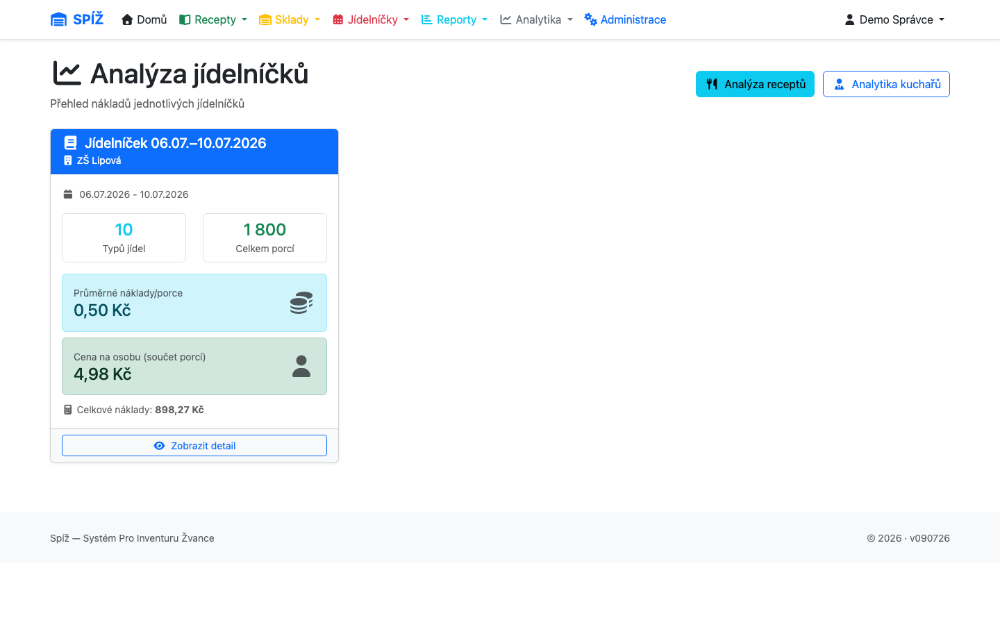
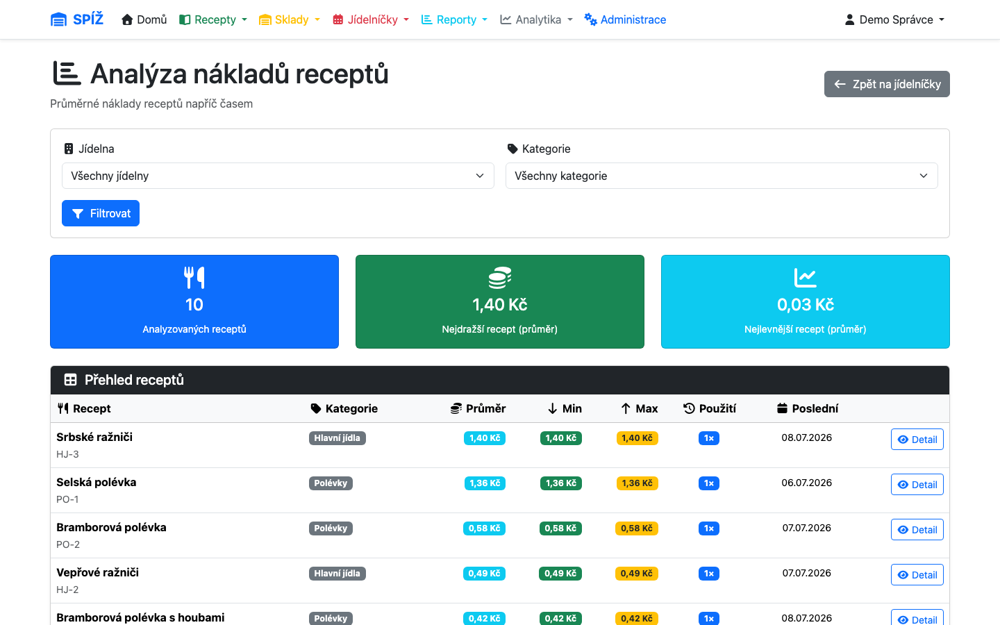
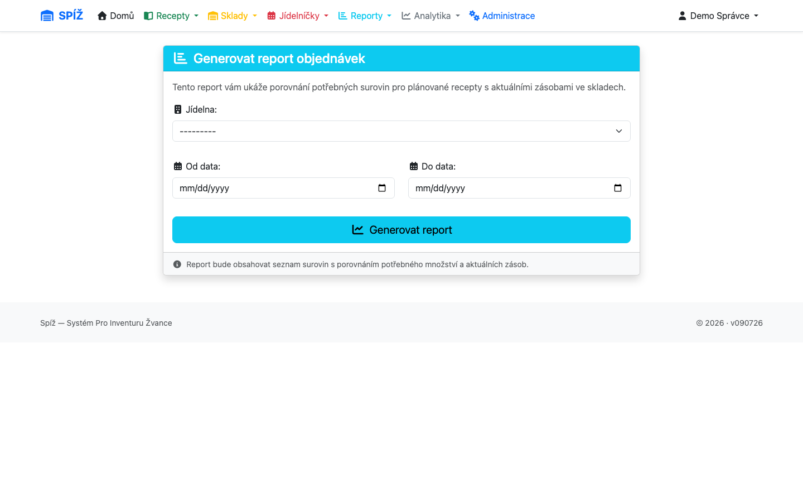

# 10. Analytika a reporty

Analytika odpovídá na otázku „kolik nás co stojí“, reporty na otázku „co máme objednat“. Obojí čerpá z dat, která vznikají běžným provozem — čím poctivěji vedete příjemky, výdejky a odpisy, tím užitečnější čísla dostanete.

## Náklady jídelníčků

**Analytika → Náklady jídelníčků** (`/analytics/`).

Seznam jídelních plánů s průměrnými náklady; detail plánu rozepisuje náklad **na porci** každého jídla i celkové náklady dní. Výpočet vychází z kalkulace ceny porce (kapitola [3](03-suroviny-a-receptury.md)): norma × průměrná skladová cena surovin jídelny, včetně případných úprav ingrediencí.

⚠️ **Pozor:** Jídlo se surovinou bez skladové ceny (dosud nenaskladněnou) vychází levněji, než ve skutečnosti je. Podezřele nízké náklady = nejprve zkontrolovat, zda všechny suroviny prošly příjemkou.

## Vývoj cen receptů

**Analytika → Vývoj cen receptů** (`/analytics/recipe-costs/`).

Ukazuje, jak se náklad na porci vyvíjel v čase — díky **cenové historii** (kapitola [4](04-prijem-zbozi.md)) systém přepočítá kalkulaci k libovolnému minulému datu. Detail receptu vykreslí křivku ceny a rozpad po surovinách; snadno tak najdete, která surovina zdražení způsobila.

💡 **K čemu to je:** Podklad pro úpravu cen obědů. Místo dojmu „nějak se to prodražuje“ máte graf: guláš od ledna +18 %, z toho hovězí +25 %.

## Analýza odpisů

**Analytika → analýza odpisů** (`/analytics/write-offs/`) sčítá odpisy podle **kategorií** (úklid, personál, bufet…) za zvolené období — v nákladových cenách z okamžiku odpisu. Ukáže, kolik provoz „projí“ mimo vaření.

## Analytika kuchařů

**Analytika → Analytika kuchařů** (`/analytics/kuchari/`) vyhodnocuje výdejkové dokumenty podle přiřazeného kuchaře — kolik vaření kdo zajišťoval a v jakém objemu.

## Objednávkový report

**Reporty → Report objednávek** (`/reports/order-report/`).

Zadáte jídelnu a období — systém projde naplánované jídelníčky a pro každou surovinu spočte:

| Sloupec | Význam |
|---|---|
| **Potřeba** | Kolik vyžadují naplánovaná jídla (normy × efektivní porce) |
| **Na skladě** | Aktuální dostupné množství ve skladech jídelny |
| **Objednat** | Rozdíl — co chybí |

Se značkami ✓ dost / ⚠ těsně / ✗ chybí. Report je hlavní podklad pro objednávku u dodavatele; lze ho **exportovat do Excelu** (s poznámkovým sloupcem pro ruční korekce) i vytisknout.

💡 **Proč se počítá z dostupného, ne fyzického množství:** Zboží blokované připravenými výdejkami už je „slíbené“ — kdyby ho report počítal jako volné, objednali byste málo.

⚠️ **Pozor:** Report vidí jen to, co je v jídelníčku. Nezaplánované akce (rauty, výlety) do potřeby nevstupují — přičtěte je ručně do poznámek.

---

*Technická poznámka pro vývojáře: `apps/analytics/views.py` (`menu_analytics_list`, `recipe_cost_analysis`, `write_off_analytics`, `cook_analytics`) — kalkulace deleguje na `Recipe.calculate_portion_price()` s `price_date` a `IngredientPriceHistory.get_prices_bulk()` (hromadné dotazy kvůli výkonu). Report: `apps/reports/views.py` → `generate_order_report(canteen, date_from, date_to)`; Excel přes openpyxl.*
