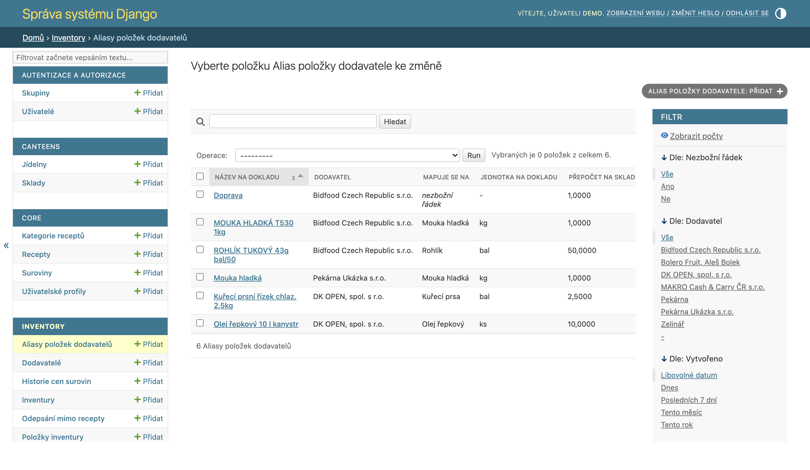

# 11. Správa systému

Kapitola pro správce: uživatelé a oprávnění, zálohy, údržba a hranice mezi aplikací a Django adminem.

## Django admin: co v něm řešit a co ne

**Administrace → Django Admin** (`/admin/`) je nízkoúrovňové rozhraní nad databází.

**Patří sem:**

* zakládání a správa **uživatelů** a jejich profilů,
* správa **dodavatelů** a jejich šablon položek,
* **aliasy položek dodavatelů** (`SupplierItemAlias`) — oprava špatně naučeného párování dodavatelského názvu na surovinu nebo špatného přepočtu jednotek (souvisí s importem příjemky z fotky, viz níže),
* výjimečné zásahy pod dohledem (smazání omylem založeného prázdného dokladu ve stavu návrhu).

Seznam se řadí podle četnosti použití, takže nahoře jsou aliasy, na kterých nejvíc záleží. Kurzívou *nezbožní řádek* jsou označené naučené výjimky (doprava, obaly, zaokrouhlení), které se do příjemky nikdy nedostanou.

💡 **Proč je mazání aliasu bezpečná oprava:** Smazání aliasu jen zapomene naučené pravidlo — na už zapsané doklady nesahá. Příště se dodavatelský název namapuje znovu, uživatel jen vybere správnou surovinu (nebo přepočet) ručně a systém se přeučí. Na rozdíl od mazání dokladů tu tedy nehrozí poškození skladu ani historie.

**Nepatří sem** (admin obchází aplikační logiku — nevrací zásoby, nepřepočítává blokace, nepíše historii):

* mazání potvrzených příjemek, dokončených převodek, odpisů a výdejek,
* ruční přepínání zámku skladu (`is_locked`) — viz kapitola [6](06-inventura.md),
* úprava skladových množství — používejte inventuru/odpis/příjemku.

⚠️ **Pozor:** Zlaté pravidlo: **doklad, který už pohnul skladem, se v adminu nemaže.** Bezpečně lze mazat jen návrhy (DRAFT), které se skladu nedotkly.

## Správa uživatelů krok za krokem

1. **Admin → Users → Add user**: uživatelské jméno + heslo (dvakrát).
2. Ve druhém kroku vyplňte jméno, příjmení, e-mail. **Nezaškrtávejte** *staff* ani *superuser* běžným uživatelům.
3. **Admin → User profiles → Add**: vyberte uživatele a zaškrtejte **jídelny**, ke kterým smí. Bez profilu uživatel neuvidí žádná data!
4. Volitelně **pouze pro čtení** (`is_readonly`) — pro kontrolní role (ekonomka, vedení).

Role shrnuje kapitola [1](01-uvod-a-pojmy.md). Superusera zakládejte jen správcům — vidí a smí vše, včetně admin rozhraní.

💡 **Proč jsou oprávnění per jídelna, a ne per obrazovka:** Provozy sdílejí jednu instalaci systému, ale data si nesmí vidět navzájem. Uživatel proto dostává **jídelny**, ne funkce — v rámci své jídelny smí všechno (kromě readonly), cizí jídelna pro něj neexistuje. Je to jednodušší na správu a bezpečnější než matice desítek dílčích práv.

## Rozpoznávání dokladů (OCR)

Systém umí založit příjemku z **fotky dodacího listu** — nahranou fotku přečte přes Mistral OCR a předvyplní jí formulář (kapitola [4](04-prijem-zbozi.md)). Je to volitelná funkce: bez nastaveného klíče systém funguje úplně normálně dál, doklady se jen zadávají ručně nebo importují z XML/CSV.

Nastavuje se proměnnými prostředí:

| Proměnná | Výchozí hodnota | Význam |
|---|---|---|
| `MISTRAL_API_KEY` | prázdné | Přístupový klíč k Mistral OCR. Bez něj je nahrávání fotky zablokované. |
| `MISTRAL_OCR_MODEL` | `mistral-ocr-latest` | Který OCR model se volá. |
| `OCR_SCAN_RETENTION_DAYS` | `7` | Za kolik dní vyprší nedokončený import (fotka nahraná, ale příjemka nikdy nevznikla/nepotvrzena). |

V Dockeru se klíč předává přes `docker-compose.yml` (`MISTRAL_API_KEY=${MISTRAL_API_KEY:-}`) — stačí ho mít v prostředí nebo v `.env`, nic dalšího se neupravuje. Bez klíče se formulář pro nahrání fotky zobrazí zablokovaný s hláškou „Rozpoznávání dokladů není nastavené." a odkazem na ruční zadání příjemky.

Nahraná fotka se ukládá zmenšená pod `MEDIA_ROOT`. Po **potvrzení** příjemky se soubor smaže — dál už neslouží k ničemu. Fotka k importu, který nikdo nedokončil (koncept se nikdy nepotvrdil, nebo uživatel průvodce opustil), vyprší po `OCR_SCAN_RETENTION_DAYS` dnech. Rozpoznaná anotace (přepis dokladu tak, jak ho OCR přečetlo) zůstává natrvalo, i po smazání fotky.

💡 **Proč se fotka maže, ale anotace zůstává:** Fotka je pracovní materiál — slouží ke kontrole položek proti originálu při zadávání a zabírá místo, které se s dalšími doklady jen kupí. Anotace je oproti tomu malá a čitelná: když se za měsíc nesejde sklad, jde z ní zjistit, co systém z dokladu přečetl, aniž by bylo potřeba fotku znovu vyhledávat nebo ji vůbec mít.

Úklid nedokončených importů nemá vlastní plánovač — veze se na dalším nahrání fotky (proběhne nejvýš jednou denně, aby nezdržoval každý upload). Pro ruční nebo pravidelný úklid (např. z cronu) slouží `manage.py purge_receipt_scans`.

⚠️ **Pozor:** Fotky dodacích listů jsou provozní doklady s obchodními údaji (ceny, dodavatel, sortiment). Lhůtu v `OCR_SCAN_RETENTION_DAYS` nenastavujte zbytečně dlouhou a zálohy adresáře `media/` řešte stejně opatrně jako databázi.

## Zálohy a obnova (XML)

**Administrace → Zálohy** (`/backup/`, pouze superuser).

### Export

Záloha se exportuje do jednoho XML souboru. Zaškrtáváte, **které entity** zahrnout — od základní trojice (suroviny, kategorie, recepty) po kompletní zálohu včetně dokladů:

suroviny · kategorie · recepty · jídelny · sklady · dodavatelé · stav skladů · šablony jídelníčků · jídelníčky · výrobní příkazy · příjemky · převodky · inventury · odpisy · výdejky · historie cen · uživatelé

Systém hlídá **závislosti**: vyberete-li recepty, přibalí suroviny a kategorie; vyberete-li stav skladů, přibalí sklady a jídelny atd. Nemůže tak vzniknout záloha, která by při obnově odkazovala do prázdna.

💡 **Proč XML, a ne kopie databáze:** XML záloha je čitelná, přenositelná mezi verzemi systému a selektivní — lze přenést jen receptury do jiné instalace, nebo obnovit jen šablony. Kopie databázového souboru je vhodná jako druhá vrstva (viz Údržba), ale neumí částečnou obnovu.

### Obnova / import

Import téhož XML na stejné stránce. Chová se **doplňkově**: existující záznamy (podle názvu/kódu) ponechá a doplní chybějící údaje, nové vytvoří. Import tedy bezpečně slouží i k přenosu číselníků mezi instalacemi.

⚠️ **Pozor:** Před velkými operacemi (hromadný import, čištění dat, aktualizace systému) vždy nejdřív exportujte kompletní zálohu. A zálohu, kterou jste nikdy nezkusili obnovit, nepovažujte za zálohu.

## Údržba a doporučený režim

* **Denně**: automatická kopie databázového souboru (zajišťuje hosting/OS — mimo aplikaci).
* **Týdně**: XML export kompletní zálohy (uchovávejte mimo server).
* **Průběžně**: sledovat záporné skladové karty (kapitola [8](08-vydejky.md)) a „visící“ doklady — převodky V PŘEVOZU a inventury PROBÍHÁ starší než pár dní, rozpracované importy z fotky (koncepty příjemek, které nikdo nepotvrdil) a příjemky čekající na srovnání měrných jednotek.
* **Po aktualizaci systému**: projít CHANGELOG a ověřit kritické workflow (příjemka → výdejka) na zkušebním dokladu.

## Bezpečnost dat

* Oddělení jídelen je vynuceno na úrovni aplikace — každý pohled filtruje data podle profilu uživatele; přímý přístup na cizí URL končí chybou oprávnění.
* Readonly uživatelé nemohou vytvářet ani měnit žádné doklady.
* Auditní stopy: doklady nesou autora a časy, ceny mají historii, inventury evidují kdo zahájil/dokončil/zrušil, deaktivace surovin kdo a kdy.
* Hesla spravuje Django (bezpečné hashování); heslo resetuje správce v adminu na kartě uživatele.

---

*Technická poznámka pro vývojáře: Zálohy: `apps/core/backup.py` — `ALL_ENTITIES`, `ENTITY_DEPENDENCIES`, `get_required_entities()`; UI `apps/core/views.py` (`backup_page`, export/import view), CLI ekvivalenty `manage.py export_backup_xml` / `import_backup_xml`. Oprávnění: `UserProfile` + `user_can_access_canteen()`; DB: SQLite, cesta přes env `SQLITE_DB_PATH` (výchozí `db.sqlite3` v kořeni projektu). OCR: `MISTRAL_API_KEY` / `MISTRAL_OCR_MODEL` / `OCR_SCAN_RETENTION_DAYS` v `spiz_project/settings.py`, mazání souboru `GoodsReceiptScan.delete_file()`, úklid `apps/inventory/ocr/storage.py` (`maybe_purge`), příkazy `manage.py purge_receipt_scans` a `manage.py ocr_replay`, naučené mapování `SupplierItemAlias` (`apps/inventory/models.py`).*
