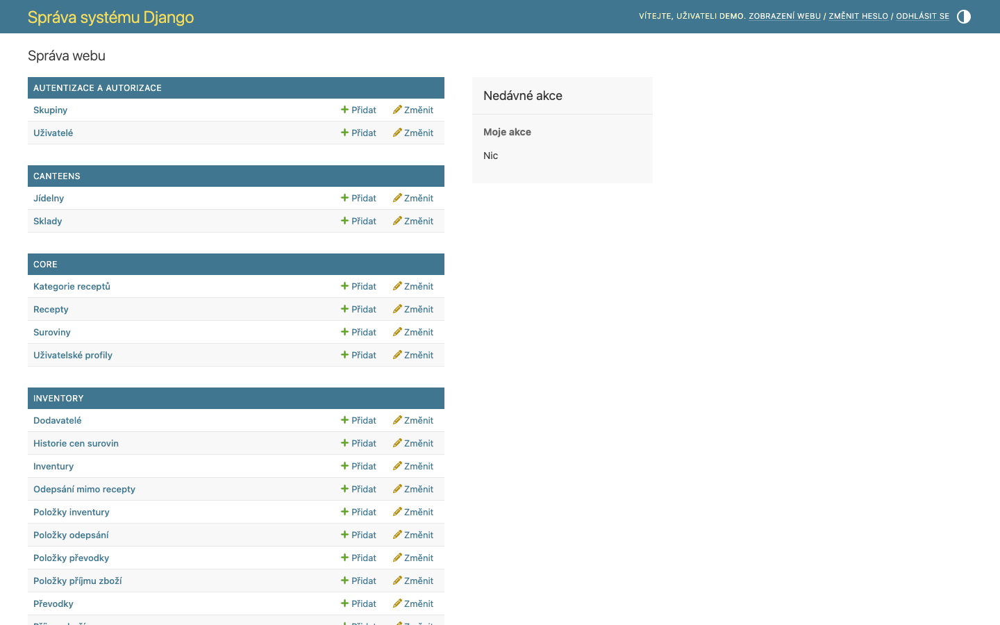
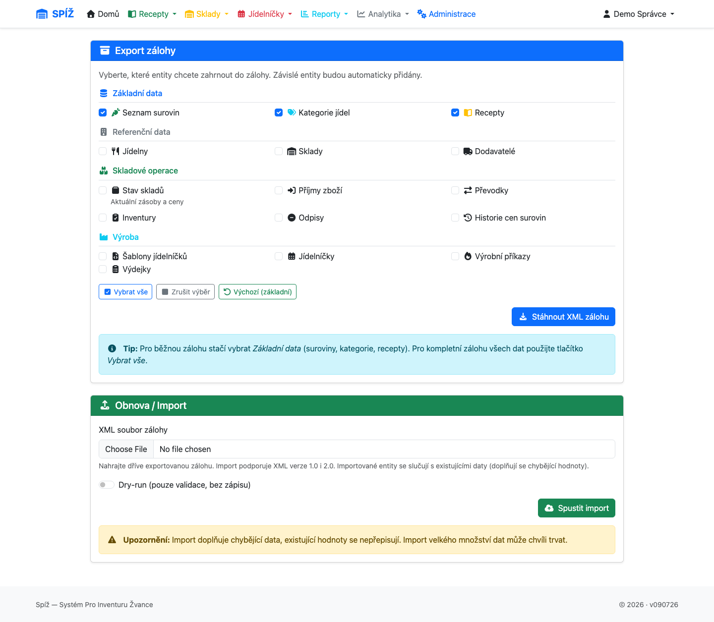

# 11. Správa systému

Kapitola pro správce: uživatelé a oprávnění, zálohy, údržba a hranice mezi aplikací a Django adminem.

## Django admin: co v něm řešit a co ne

**Administrace → Django Admin** (`/admin/`) je nízkoúrovňové rozhraní nad databází.

**Patří sem:**

* zakládání a správa **uživatelů** a jejich profilů,
* správa **dodavatelů** a jejich šablon položek,
* výjimečné zásahy pod dohledem (smazání omylem založeného prázdného dokladu ve stavu návrhu).

**Nepatří sem** (admin obchází aplikační logiku — nevrací zásoby, nepřepočítává blokace, nepíše historii):

* mazání potvrzených příjemek, dokončených převodek, odpisů a výdejek,
* ruční přepínání zámku skladu (`is_locked`) — viz kapitola [6](06-inventura.md),
* úprava skladových množství — používejte inventuru/odpis/příjemku.

⚠️ **Pozor:** Zlaté pravidlo: **doklad, který už pohnul skladem, se v adminu nemaže.** Bezpečně lze mazat jen návrhy (DRAFT), které se skladu nedotkly.

## Správa uživatelů krok za krokem

1. **Admin → Users → Add user**: uživatelské jméno + heslo (dvakrát).
2. Ve druhém kroku vyplňte jméno, příjmení, e-mail. **Nezaškrtávejte** *staff* ani *superuser* běžným uživatelům.
3. **Admin → User profiles → Add**: vyberte uživatele a zaškrtejte **jídelny**, ke kterým smí. Bez profilu uživatel neuvidí žádná data!
4. Volitelně **pouze pro čtení** (`is_readonly`) — pro kontrolní role (ekonomka, vedení).

Role shrnuje kapitola [1](01-uvod-a-pojmy.md). Superusera zakládejte jen správcům — vidí a smí vše, včetně admin rozhraní.

💡 **Proč jsou oprávnění per jídelna, a ne per obrazovka:** Provozy sdílejí jednu instalaci systému, ale data si nesmí vidět navzájem. Uživatel proto dostává **jídelny**, ne funkce — v rámci své jídelny smí všechno (kromě readonly), cizí jídelna pro něj neexistuje. Je to jednodušší na správu a bezpečnější než matice desítek dílčích práv.

## Zálohy a obnova (XML)

**Administrace → Zálohy** (`/backup/`, pouze superuser).

### Export

Záloha se exportuje do jednoho XML souboru. Zaškrtáváte, **které entity** zahrnout — od základní trojice (suroviny, kategorie, recepty) po kompletní zálohu včetně dokladů:

suroviny · kategorie · recepty · jídelny · sklady · dodavatelé · stav skladů · šablony jídelníčků · jídelníčky · výrobní příkazy · příjemky · převodky · inventury · odpisy · výdejky · historie cen · uživatelé

Systém hlídá **závislosti**: vyberete-li recepty, přibalí suroviny a kategorie; vyberete-li stav skladů, přibalí sklady a jídelny atd. Nemůže tak vzniknout záloha, která by při obnově odkazovala do prázdna.

💡 **Proč XML, a ne kopie databáze:** XML záloha je čitelná, přenositelná mezi verzemi systému a selektivní — lze přenést jen receptury do jiné instalace, nebo obnovit jen šablony. Kopie databázového souboru je vhodná jako druhá vrstva (viz Údržba), ale neumí částečnou obnovu.

### Obnova / import

Import téhož XML na stejné stránce. Chová se **doplňkově**: existující záznamy (podle názvu/kódu) ponechá a doplní chybějící údaje, nové vytvoří. Import tedy bezpečně slouží i k přenosu číselníků mezi instalacemi.

⚠️ **Pozor:** Před velkými operacemi (hromadný import, čištění dat, aktualizace systému) vždy nejdřív exportujte kompletní zálohu. A zálohu, kterou jste nikdy nezkusili obnovit, nepovažujte za zálohu.

## Údržba a doporučený režim

* **Denně**: automatická kopie databázového souboru (zajišťuje hosting/OS — mimo aplikaci).
* **Týdně**: XML export kompletní zálohy (uchovávejte mimo server).
* **Průběžně**: sledovat záporné skladové karty (kapitola [8](08-vydejky.md)) a „visící“ doklady — převodky V PŘEVOZU a inventury PROBÍHÁ starší než pár dní.
* **Po aktualizaci systému**: projít CHANGELOG a ověřit kritické workflow (příjemka → výdejka) na zkušebním dokladu.

## Bezpečnost dat

* Oddělení jídelen je vynuceno na úrovni aplikace — každý pohled filtruje data podle profilu uživatele; přímý přístup na cizí URL končí chybou oprávnění.
* Readonly uživatelé nemohou vytvářet ani měnit žádné doklady.
* Auditní stopy: doklady nesou autora a časy, ceny mají historii, inventury evidují kdo zahájil/dokončil/zrušil, deaktivace surovin kdo a kdy.
* Hesla spravuje Django (bezpečné hashování); heslo resetuje správce v adminu na kartě uživatele.

---

*Technická poznámka pro vývojáře: Zálohy: `apps/core/backup.py` — `ALL_ENTITIES`, `ENTITY_DEPENDENCIES`, `get_required_entities()`; UI `apps/core/views.py` (`backup_page`, export/import view), CLI ekvivalenty `manage.py export_backup_xml` / `import_backup_xml`. Oprávnění: `UserProfile` + `user_can_access_canteen()`; DB: SQLite, cesta přes env `SQLITE_DB_PATH` (výchozí `db.sqlite3` v kořeni projektu).*
