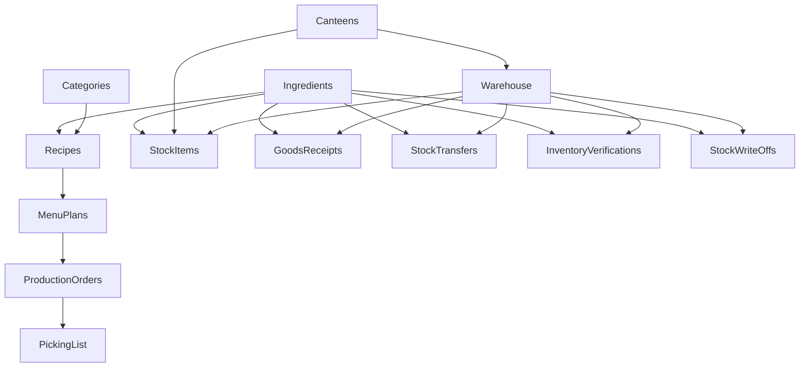

# Plán rozšíření zálohování - Výběr entit

## Současný stav

Zálohování je implementováno v `apps/core/backup.py` a podporuje pouze:
- Suroviny (Ingredients)
- Kategorie jídel (Categories)
- Recepty (Recipes) včetně ingrediencí receptu

## Cíl

Rozšířit zálohování o možnost výběru, co přesně zálohovat:
1. ✅ Seznam surovin (Ingredients) - existuje
2. ✅ Kategorie jídel (Categories) - existuje
3. ✅ Recepty (Recipes) - existuje
4. 🆕 Stav skladů (StockItem)
5. 🆕 Jídelníčky (MenuPlan)
6. 🆕 Výrobní příkazy (ProductionOrder)
7. 🆕 Šablony jídelníčků (MenuTemplate)
8. 🆕 Příjmy zboží (GoodsReceipt)
9. 🆕 Převodky (StockTransfer)
10. 🆕 Inventury (InventoryVerification)
11. 🆕 Odpisy (StockWriteOff)

## Technický návrh

### 1. Struktura exportu

XML bude mít nový atribut `version="2.0"` a každá entita bude ve vlastním elementu:

```xml
<Backup version="2.0" exportDate="2026-01-29T10:00:00">
  <Ingredients>...</Ingredients>
  <Categories>...</Categories>
  <Recipes>...</Recipes>
  <StockItems>...</StockItems>
  <MenuPlans>...</MenuPlans>
  <MenuTemplates>...</MenuTemplates>
  <ProductionOrders>...</ProductionOrders>
  <GoodsReceipts>...</GoodsReceipts>
  <StockTransfers>...</StockTransfers>
  <InventoryVerifications>...</InventoryVerifications>
  <StockWriteOffs>...</StockWriteOffs>
</Backup>
```

### 2. Závislosti mezi entitami



**Pravidla pro závislosti:**
- Pokud se exportují recepty, musí se exportovat i suroviny a kategorie
- Pokud se exportují výrobní příkazy, musí se exportovat i recepty a jídelníčky
- Pokud se exportují skladové položky, měly by se exportovat i suroviny
- Pokud se exportují příjmy/převodky/inventury/odpisy, musí se exportovat skladové položky

### 3. API změny

#### `export_backup_xml(selected_entities: list[str]) -> bytes`
- Parametr `selected_entities` - seznam klíčů entit k exportu
- Vrátí XML s pouze vybranými entitami

#### `import_backup_xml(xml_content: bytes, dry_run: bool = False) -> dict`
- Zachovává zpětnou kompatibilitu s verzí 1.0
- Importuje pouze entity přítomné v XML
- Vrací report pro každou importovanou entitu

### 4. UI změny

V šabloně `templates/core/backup.html` přidat:
- Sekci "Výběr dat pro export" s checkboxy
- Skupiny entit podle závislostí
- Validaci výběru (kontrola závislostí)
- Indikaci doporučených/nutných závislostí

### 5. Management commandy

Rozšířit `export_backup_xml.py` a `import_backup_xml.py` o argumenty:
- `--include-ingredients`
- `--include-categories`
- `--include-recipes`
- `--include-stock`
- `--include-menus`
- `--include-templates`
- `--include-production-orders`
- `--include-receipts`
- `--include-transfers`
- `--include-inventory`
- `--include-writeoffs`
- `--include-all` (výchozí pro zpětnou kompatibilitu)

## Implementační kroky

1. **Rozšířit `backup.py`**:
   - Přidat konstanty pro názvy entit
   - Upravit `export_backup_xml` pro podporu výběru
   - Implementovat export funkcí pro nové entity
   - Upravit `import_backup_xml` pro podporu částečných importů

2. **Aktualizovat views**:
   - Upravit `backup_export_xml_view` pro příjem parametrů z GET/POST
   - Zachovat zpětnou kompatibilitu (výchozí = všechny základní entity)

3. **Upravit šablonu**:
   - Přidat formulář s checkboxy pro výběr entit
   - Přidat JavaScript pro validaci závislostí
   - Zachovat jednoduché "Stáhnout vše" tlačítko

4. **Aktualizovat management commandy**:
   - Přidat argumenty pro výběr entit
   - Upravit logiku volání export/import funkcí

## Poznámky k entitám

### Skladové entity
- **StockItem**: Stav skladů - množství, cena, DPH
- **GoodsReceipt**: Příjmy zboží včetně položek
- **StockTransfer**: Převodky mezi sklady včetně položek
- **InventoryVerification**: Inventury včetně položek
- **StockWriteOff**: Odpisy mimo recepty včetně položek

### Výrobní entity
- **MenuPlan**: Jídelníčky včetně koeficientů
- **MenuTemplate**: Šablony jídelníčků (XML obsah)
- **ProductionOrder**: Výrobní příkazy včetně variant porcí a override ingrediencí

### Referenční entity
- **Canteen**: Jídelny
- **Warehouse**: Sklady
- **Supplier**: Dodavatelé
- **SupplierIngredientTemplate**: Šablony surovin dodavatelů

## Rozhodnutí o rozsahu

Pro první implementaci navrhuji:
1. ✅ Základní entity (suroviny, kategorie, recepty) - již existuje
2. ✅ Stav skladů (StockItem)
3. ✅ Jídelníčky (MenuPlan) s koeficienty
4. ✅ Výrobní příkazy (ProductionOrder) s variantami a override
5. ✅ Šablony (MenuTemplate)
6. ✅ Příjmy zboží (GoodsReceipt)
7. ✅ Převodky (StockTransfer)
8. ✅ Inventury (InventoryVerification)
9. ✅ Odpisy (StockWriteOff)

Referenční entity (Canteen, Warehouse, Supplier) se budou exportovat automaticky pokud je potřeba pro vybrané entity.
